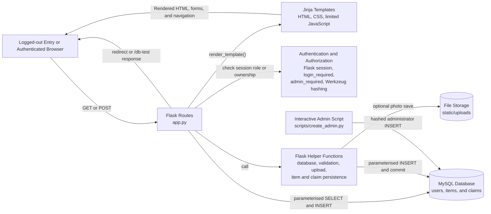
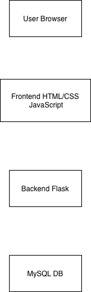

# Implemented System Architecture

## 1. Purpose

This document describes the final implemented architecture of the Campus Lost and Found Platform. It maps the delivered Flask application to its server-rendered user interface, session-based authentication, MySQL persistence, and uploaded-file storage. The Mermaid diagram and implementation mapping below are authoritative for the current repository.

The completed US01–US07 baseline was later refined in response to the confirmed lecturer request: "The final version should include a user system and an administrator system that can be used to view lost-and-found records." This later refinement adds accounts, account-owned records, My Reports, and a read-only administrator view without rewriting the historical baseline.

## 2. Implemented architecture overview

The application uses a server-rendered, three-layer structure:

1. A logged-out visitor may use the Home, Register, and Login entry points; an
   authenticated user or administrator uses the lost-and-found pages and forms.
2. Flask routes, authentication decorators, and helper functions process requests and render Jinja templates or issue redirects.
3. `mysql.connector` persists users, item reports, and claim requests in MySQL, while optional uploaded photos are stored separately under `static/uploads`.

This is a locally run Flask/MySQL application architecture. The repository's documentation pages are not a deployment of the Flask application or its database.

## 3. Presentation layer

The presentation layer consists of server-rendered Jinja HTML templates, `static/css/style.css`, limited feedback behaviour in `static/js/ui-feedback.js`, browser forms, and normal link navigation.

The implemented templates provide:

- home navigation;
- lost-item and found-item report forms;
- item browsing, keyword search, and filtering by report type and category;
- individual item details, including an uploaded photo or a fallback;
- the claim-request form; and
- the dedicated Claim Request Submitted page;
- registration and login forms;
- an account-scoped My Reports page; and
- a read-only administrator dashboard with summary, item, and claim records.

`_navigation.html` provides one shared, session-aware navigation component.
Logged-out visitors see only the public entry navigation, including Login and
Register. Authenticated users see reporting, browsing, My Reports, their name,
and a POST Logout control; administrators additionally see Admin Dashboard.
Lost-and-found reporting, records, details, and claims are not available without
login. The logged-out static allowlist contains only the stylesheet and UI
feedback script required by the three entry pages; uploaded item images and
other operational assets require authentication.

HTML `required` attributes provide the main empty-field guard on item-report forms. The JavaScript adds button ripple feedback; it does not perform all form validation or provide a separate application client.

## 4. Flask application layer

`app.py` defines the Flask application as routes and module-level helper functions rather than separate service or controller classes.

- `get_database_connection()` creates a `mysql.connector` connection from environment variables.
- `login_required()` protects every operational lost-and-found route, and
  `admin_required()` additionally requires the `admin` role stored in the
  authenticated session.
- `is_safe_next_url()` permits only local absolute-path return destinations and rejects external or scheme-relative redirects.
- `is_allowed_file()` checks an uploaded filename extension against `png`, `jpg`, `jpeg`, and `gif`.
- `save_item_report()` optionally saves a photo, inserts an item row, and commits the transaction.
- `save_claim_request()` inserts a claim with status `pending` and commits the transaction.
- `close_database_resources()` centralises cursor and connection cleanup across
  the database-backed routes and helpers.

Public registration normalises email addresses, applies basic email and length validation, always assigns role `user`, and stores a Werkzeug password hash. Login checks the stored hash, clears old session state, and stores only `user_id`, `user_name`, and `user_role`. Logout is POST-only and clears the session. Normal users land on `/my-reports`; administrators land on `/admin`.

The `/items` route accepts the keyword parameter `q`. It applies `LIKE` to `item_name`, `description`, and `location`; optional `report_type` and `category` filters are combined with the keyword condition using `AND`. Results are ordered by `created_at DESC, id DESC`. There is no pagination.

The claim flow first queries the selected item and returns HTTP 404 if it does not exist. On POST, `name`, `contact`, and `message` are stripped and rejected if any value is empty or whitespace-only. A valid request is stored and redirected to `/claim-success/<int:item_id>`.

## 5. Persistence layer

MySQL is the implemented relational persistence layer. The schema in `database.sql` creates:

- `users`, which stores a unique email, display name, password hash, role, and creation timestamp;
- `items`, which stores lost and found reports, their contact details, current status, optional `image_path`, and nullable `user_id`; and
- `claims`, which stores claim requests associated with an item through
  `claims.item_id` and its authenticated account through `claims.user_id`.

`items.user_id` and `claims.user_id` reference `users.id` but remain nullable in
the schema solely to preserve rows created before the account enhancement. The
current authenticated application always inserts the session account ID and
does not create new `NULL` owners. `migrations/001_add_user_admin_system.sql` is
the one-time, non-destructive migration for an existing database; fresh
installations use the updated `database.sql`.

Application queries use `%s` placeholders with separate parameter tuples. Item and claim inserts are committed explicitly. The application closes cursors and open connections in `finally` blocks.

## 6. Uploaded-file storage

Photos are optional. When a filename is supplied, `save_item_report()`:

1. checks only the filename extension with `is_allowed_file()`;
2. normalises the name with `secure_filename()`;
3. saves the file beneath `static/uploads`; and
4. stores `uploads/<filename>` in `items.image_path`.

The database stores the relative path, not the image data. The implementation does not validate MIME content, upload size, filename collisions, or malware.

## 7. Main request flows

### Report an item

After `login_required()` confirms an authenticated account, the browser sends a
GET or POST to `/report-lost-item` or `/report-found-item`. On POST, the route
calls `save_item_report()` with the appropriate report type and date-field name.
The helper saves the session `user_id` with the report, may save an optional
photo, inserts the item into MySQL, and commits. The route flashes a success or
error message and redirects to the same report form.

### Browse, search, filter, and view details

An authenticated browser requests `/items`, optionally with `q`, `report_type`,
and `category`. The `items()` route builds a parameterised query, obtains rows
from MySQL, and renders `items.html`. Selecting a result requests
`/items/<int:item_id>`; `item_detail()` returns the rendered details page or
HTTP 404. `/item-details` redirects authenticated users to `/items` because no
item has been selected. Logged-out requests are redirected to Login.

### Submit a claim

For an authenticated user, the Item Details template displays **Submit Claim
Request** only when the rendered item has `report_type` equal to `found`.
`/claim-request/<int:item_id>` loads the selected item, validates stripped claim
fields on POST, and calls `save_claim_request()` for valid input. The helper
inserts a `pending` claim with the session `user_id` and commits. Flask then
redirects to the login-protected `/claim-success/<int:item_id>` page.

Every item report and claim request uses the required authenticated
`session["user_id"]`. Nullable ownership is never selected as a current
application path.

### Register, log in, and log out

`/register` accepts a full name, normalised email, password, and confirmation. Valid public registration inserts only role `user` with a Werkzeug-generated password hash and redirects to `/login`. `/login` uses a generic invalid-credentials message and accepts only a locally validated `next` destination. A successful login rebuilds the logical session state. `/logout` accepts POST only, clears the session, flashes confirmation, and redirects home.

Administrator accounts are not created through public registration. `scripts/create_admin.py` loads the existing environment-based database settings, obtains hidden password input through `getpass`, hashes the password, and inserts role `admin`.

### View owned and administrative records

`/my-reports` requires login and selects only `items.user_id = session["user_id"]`, newest first. Administrators may use it, but see only reports owned by their own account.

`/admin` requires an authenticated administrator and is read-only. It selects
summary counts, all item reports, and all claim requests. `LEFT JOIN users`
keeps nullable pre-enhancement ownership rows visible under the legacy fallback
labels. The dashboard does not approve, reject, delete, ban, or update records.

### Check database connectivity

`/db-test` requires an administrator session, calls
`get_database_connection()`, runs `SHOW TABLES`, and returns a small
JSON-compatible response describing success or failure.

## 8. Security and implementation boundaries

- Database values are supplied through parameterised SQL rather than interpolated into query strings.
- Flask refuses requests when the environment-provided `APP_SECRET_KEY` is absent. Database settings also remain environment-based, with placeholders only in `.env.example`.
- Session cookies are configured `HttpOnly` and `SameSite=Lax`. The session stores only user ID, name, and role, never a password or hash.
- Passwords are stored using Werkzeug password hashing and compared with `check_password_hash()`.
- Public registration always writes role `user`; administrator creation is an interactive local script. Authorization never trusts a role supplied by a form or URL.
- Login return paths are limited to local absolute paths, and a normal user cannot use `next` to enter `/admin`.
- Login is enforced server-side for reporting, browsing, details, claims, claim
  confirmation, and My Reports; each new item/claim insert uses the session ID.
- My Reports ownership filtering and the administrator role check are enforced server-side.
- `secure_filename()` normalises uploaded names, but extension-only validation is not proof of file content or safety.
- Item-report forms mainly depend on browser-side `required` attributes; the report routes do not explicitly strip and reject every required text field.
- The Item Details template is the only found-item eligibility check for claims. A direct request to `/claim-request/<int:item_id>` is not independently rejected when the stored item has another `report_type`.
- The claim-success route uses `item_id`, not a claim identifier, and does not display submitted contact or verification details.
- No CSRF token framework, email verification, password recovery, multi-factor authentication, login throttling, account-management UI, notification, claim-tracking, or state-changing administrative workflow is implemented.

## 9. Deferred architecture

The completed US01–US07 baseline remains intact. The later lecturer-requested refinement adds registration/login/logout, account-scoped My Reports, and read-only administrator viewing. It covers the viewing intent associated with US11 without introducing report editing.

The following broader workflows remain deferred:

- US08 Track Claim Status;
- US09 state-changing claim review decisions such as approval or rejection;
- US10 Update Item Status; and
- account profile management, report editing, and administrator user management.

## 10. Implementation mapping

| Route or component | Flask function/helper | Current implementation |
|---|---|---|
| `/` | `home()` | Renders `templates/index.html`. |
| `/register` | `register()` | Validates and creates a password-hashed public user account; public role is always `user`. |
| `/login` | `login()` | Verifies a password hash, rebuilds authenticated session state, and applies safe local redirects. |
| `/logout` | `logout()` | POST-only session clearing and redirect to Home. |
| `/my-reports` | `my_reports()`, `login_required()` | Selects only item reports owned by the logged-in account, newest first. |
| `/admin` | `admin_dashboard()`, `admin_required()` | Renders read-only summary, item, and claim views with legacy rows retained through `LEFT JOIN`. |
| `/report-lost-item` | `report_lost_item()`, `save_item_report()`, `login_required()` | Requires login; renders/processes a lost-item form and stores the authenticated owner. |
| `/report-found-item` | `report_found_item()`, `save_item_report()`, `login_required()` | Requires login; renders/processes a found-item form and stores the authenticated owner. |
| `/items` | `items()`, `get_database_connection()`, `login_required()` | Requires login; browses, searches, filters, orders, and renders item records. |
| `/item-details` | `item_details()`, `login_required()` | Requires login and redirects to `/items` before an item is selected. |
| `/items/<int:item_id>` | `item_detail()`, `get_database_connection()`, `login_required()` | Requires login; selects one item and renders its details, or returns HTTP 404. |
| `/claim-request/<int:item_id>` | `claim_request()`, `save_claim_request()`, `login_required()` | Requires login; validates and stores a pending claim owned by the authenticated account. |
| `/claim-success/<int:item_id>` | `claim_success()`, `login_required()` | Requires login and renders the dedicated confirmation page. |
| `/db-test` | `database_test()`, `admin_required()`, `get_database_connection()` | Gives administrators a `SHOW TABLES` connectivity diagnostic without exposing database metadata publicly. |
| `static/uploads` | `is_allowed_file()`, `save_item_report()` | Stores optional uploaded files referenced by `items.image_path`. |
| `scripts/create_admin.py` | interactive script | Creates a password-hashed administrator without hard-coded credentials. |
| `users`, `items`, `claims` | `mysql.connector` calls in `app.py` | Stores required ownership for current inserts while retaining nullable historical rows. |

## Historical Design Artifact

This original image is retained as a planning artefact. It shows a simplified browser/frontend/Flask/MySQL stack but omits implemented helper behaviour and uploaded-file storage. It must not be treated as the authoritative final architecture; the Mermaid diagram and mapping above reflect the current implementation.
