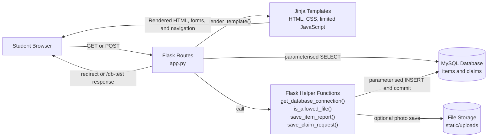

# Implemented System Architecture

## 1. Purpose

This document describes the final implemented architecture of the Campus Lost and Found Platform. It maps the delivered Flask application to its server-rendered user interface, MySQL persistence, and uploaded-file storage. The Mermaid diagram and implementation mapping below are authoritative for the current repository.

## 2. Implemented architecture overview

The application uses a server-rendered, three-layer structure:

1. A student uses HTML pages and forms in a web browser.
2. Flask routes and helper functions process requests and render Jinja templates or issue redirects.
3. `mysql.connector` persists item and claim records in MySQL, while optional uploaded photos are stored separately under `static/uploads`.

This is a locally run Flask/MySQL application architecture. The repository's documentation pages are not a deployment of the Flask application or its database.

## 3. Presentation layer

The presentation layer consists of server-rendered Jinja HTML templates, `static/css/style.css`, limited feedback behaviour in `static/js/ui-feedback.js`, browser forms, and normal link navigation.

The implemented templates provide:

- home navigation;
- lost-item and found-item report forms;
- item browsing, keyword search, and filtering by report type and category;
- individual item details, including an uploaded photo or a fallback;
- the claim-request form; and
- the dedicated Claim Request Submitted page.

HTML `required` attributes provide the main empty-field guard on item-report forms. The JavaScript adds button ripple feedback; it does not perform all form validation or provide a separate application client.

## 4. Flask application layer

`app.py` defines the Flask application as routes and module-level helper functions rather than separate service or controller classes.

- `get_database_connection()` creates a `mysql.connector` connection from environment variables.
- `is_allowed_file()` checks an uploaded filename extension against `png`, `jpg`, `jpeg`, and `gif`.
- `save_item_report()` optionally saves a photo, inserts an item row, and commits the transaction.
- `save_claim_request()` inserts a claim with status `pending` and commits the transaction.

The `/items` route accepts the keyword parameter `q`. It applies `LIKE` to `item_name`, `description`, and `location`; optional `report_type` and `category` filters are combined with the keyword condition using `AND`. Results are ordered by `created_at DESC, id DESC`. There is no pagination.

The claim flow first queries the selected item and returns HTTP 404 if it does not exist. On POST, `name`, `contact`, and `message` are stripped and rejected if any value is empty or whitespace-only. A valid request is stored and redirected to `/claim-success/<int:item_id>`.

## 5. Persistence layer

MySQL is the implemented relational persistence layer. The schema in `database.sql` creates:

- `items`, which stores lost and found reports, their contact details, current status, and an optional `image_path`; and
- `claims`, which stores claim requests associated with an item through `claims.item_id`.

Application queries use `%s` placeholders with separate parameter tuples. Item and claim inserts are committed explicitly. The application closes cursors and open connections in `finally` blocks.

## 6. Uploaded-file storage

Photos are optional. When a filename is supplied, `save_item_report()`:

1. checks only the filename extension with `is_allowed_file()`;
2. normalises the name with `secure_filename()`;
3. saves the file beneath `static/uploads`; and
4. stores `uploads/<filename>` in `items.image_path`.

The database stores the relative path, not the image data. The implementation does not validate MIME content, upload size, filename collisions, or malware.

## 7. Main request flows

### Report an item

The browser sends a GET or POST to `/report-lost-item` or `/report-found-item`. On POST, the route calls `save_item_report()` with the appropriate report type and date-field name. The helper may save an optional photo, inserts the item into MySQL, and commits. The route flashes a success or error message and redirects to the same report form.

### Browse, search, filter, and view details

The browser requests `/items`, optionally with `q`, `report_type`, and `category`. The `items()` route builds a parameterised query, obtains rows from MySQL, and renders `items.html`. Selecting a result requests `/items/<int:item_id>`; `item_detail()` returns the rendered details page or HTTP 404. `/item-details` redirects to `/items` because no item has been selected.

### Submit a claim

The Item Details template displays **Submit Claim Request** only when the rendered item has `report_type` equal to `found`. `/claim-request/<int:item_id>` loads the selected item, validates stripped claim fields on POST, and calls `save_claim_request()` for valid input. The helper inserts a `pending` claim and commits. Flask then redirects to `/claim-success/<int:item_id>`, which displays **Claim Request Submitted**, visible status **Pending**, and actions for **View Item Details** and **Browse More Items**.

### Check database connectivity

`/db-test` calls `get_database_connection()`, runs `SHOW TABLES`, and returns a small JSON-compatible response describing success or failure.

## 8. Security and implementation boundaries

- Database values are supplied through parameterised SQL rather than interpolated into query strings.
- Flask's session-backed flash messages depend on `APP_SECRET_KEY`, while database settings are loaded from environment variables.
- `secure_filename()` normalises uploaded names, but extension-only validation is not proof of file content or safety.
- Item-report forms mainly depend on browser-side `required` attributes; the report routes do not explicitly strip and reject every required text field.
- The Item Details template is the only found-item eligibility check for claims. A direct request to `/claim-request/<int:item_id>` is not independently rejected when the stored item has another `report_type`.
- The claim-success route uses `item_id`, not a claim identifier, and does not display submitted contact or verification details.
- No authentication, user-account, administrative review, approval, notification, or claim-tracking architecture is implemented.

## 9. Deferred architecture

The current architecture delivers US01–US07 together with Browse Items. The following user stories remain deferred and have no implemented routes, templates, or supporting workflow in the current application:

- US08 Track Claim Status;
- US09 Review Claim Requests;
- US10 Update Item Status; and
- US11 View My Reports.

## 10. Implementation mapping

| Route or component | Flask function/helper | Current implementation |
|---|---|---|
| `/` | `home()` | Renders `templates/index.html`. |
| `/report-lost-item` | `report_lost_item()`, `save_item_report()` | Renders and processes a lost-item form; optional photo; item insert; flash and redirect. |
| `/report-found-item` | `report_found_item()`, `save_item_report()` | Renders and processes a found-item form; optional photo; item insert; flash and redirect. |
| `/items` | `items()`, `get_database_connection()` | Browses, searches, filters, orders, and renders item records. |
| `/item-details` | `item_details()` | Redirects to `/items` before an item is selected. |
| `/items/<int:item_id>` | `item_detail()`, `get_database_connection()` | Selects one item and renders its details, or returns HTTP 404. |
| `/claim-request/<int:item_id>` | `claim_request()`, `save_claim_request()` | Loads an item, validates stripped claim fields, stores a pending claim, and redirects. |
| `/claim-success/<int:item_id>` | `claim_success()` | Renders the dedicated confirmation page with Pending status and navigation actions. |
| `/db-test` | `database_test()`, `get_database_connection()` | Runs `SHOW TABLES` and returns connectivity information. |
| `static/uploads` | `is_allowed_file()`, `save_item_report()` | Stores optional uploaded files referenced by `items.image_path`. |
| `items`, `claims` | `mysql.connector` calls in `app.py` | Stores item reports and related claim requests. |

## Historical Design Artifact

This original image is retained as a planning artefact. It shows a simplified browser/frontend/Flask/MySQL stack but omits implemented helper behaviour and uploaded-file storage. It must not be treated as the authoritative final architecture; the Mermaid diagram and mapping above reflect the current implementation.
