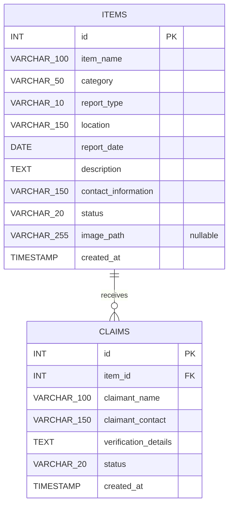
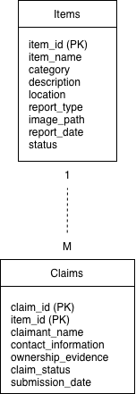

# Implemented Database Design

## 1. Database purpose

The Campus Lost and Found Platform uses MySQL to persist item reports and the claim requests made for those items. This document mirrors the implemented schema in `database.sql`; the Mermaid ER diagram and column tables below are authoritative for the current database.

The schema supports the delivered reporting, browsing, search, filtering, item-detail, photo-path, and claim-submission features. It does not contain a user table or a delivered workflow for reviewing, approving, tracking, or updating claims and items.

## 2. Implemented tables

The database contains two tables:

- `items` stores both lost and found item reports. The `report_type` column distinguishes them.
- `claims` stores claim requests and associates each request with an existing item through `item_id`.

The type labels in the diagram use underscores because Mermaid attribute types cannot contain parentheses. The Markdown tables below preserve the exact SQL declarations.

## 3. Items table

| Column | Exact SQL type/declaration | Nullability and default | Purpose |
|---|---|---|---|
| `id` | `INT AUTO_INCREMENT PRIMARY KEY` | Primary key; not null; generated automatically | Identifies one item report. |
| `item_name` | `VARCHAR(100) NOT NULL` | Not null; no explicit default | Stores the reported item name. |
| `category` | `VARCHAR(50) NOT NULL` | Not null; no explicit default | Stores the single category selected on the report form. |
| `report_type` | `VARCHAR(10) NOT NULL` | Not null; no explicit default | Distinguishes `lost` and `found` reports. |
| `location` | `VARCHAR(150) NOT NULL` | Not null; no explicit default | Stores where the item was lost or found and participates in keyword search. |
| `report_date` | `DATE NOT NULL` | Not null; no explicit default | Stores the date supplied on the lost-item or found-item form. |
| `description` | `TEXT NOT NULL` | Not null; no explicit default | Stores the item description and participates in keyword search. |
| `contact_information` | `VARCHAR(150) NOT NULL` | Not null; no explicit default | Stores the reporter's contact information. |
| `status` | `VARCHAR(20) NOT NULL DEFAULT 'active'` | Not null; defaults to `active` | Stores the current item status shown in item lists and details. |
| `image_path` | `VARCHAR(255)` | Nullable; no explicit default | Stores a relative path such as `uploads/<filename>` for an optional uploaded photo. |
| `created_at` | `TIMESTAMP DEFAULT CURRENT_TIMESTAMP` | Nullability is not explicitly declared; defaults to the current timestamp | Records insertion time and supports newest-first ordering. |

## 4. Claims table

| Column | Exact SQL type/declaration | Nullability and default | Purpose |
|---|---|---|---|
| `id` | `INT AUTO_INCREMENT PRIMARY KEY` | Primary key; not null; generated automatically | Identifies one claim request. |
| `item_id` | `INT NOT NULL` | Not null; no explicit default | References the item being claimed. |
| `claimant_name` | `VARCHAR(100) NOT NULL` | Not null; no explicit default | Stores the stripped value from the claim form's `name` field. |
| `claimant_contact` | `VARCHAR(150) NOT NULL` | Not null; no explicit default | Stores the stripped value from the claim form's `contact` field. |
| `verification_details` | `TEXT NOT NULL` | Not null; no explicit default | Stores the stripped value from the claim form's `message` field. |
| `status` | `VARCHAR(20) NOT NULL DEFAULT 'pending'` | Not null; defaults to `pending` | Stores the initial status assigned to every valid claim request. |
| `created_at` | `TIMESTAMP DEFAULT CURRENT_TIMESTAMP` | Nullability is not explicitly declared; defaults to the current timestamp | Records when the claim row was inserted. |
| Foreign key | `FOREIGN KEY (item_id) REFERENCES items(id)` | `item_id` must reference an existing `items.id` | Enforces the implemented item-to-claim relationship. |

## 5. Relationship and cardinality

`ITEMS ||--o{ CLAIMS : receives` means:

- each `claims` row references exactly one `items` row through `claims.item_id`; and
- one item may have zero, one, or many associated claim rows.

The schema does not specify cascading update or delete behaviour for this foreign key.

## 6. Field-to-feature mapping

| Delivered feature | Database fields used | Application mapping |
|---|---|---|
| US01 Report Lost Item / US02 Report Found Item | `items.item_name`, `category`, `report_type`, `location`, `report_date`, `description`, `contact_information` | `save_item_report()` inserts the report with `report_type` set by the selected Flask route. |
| Browse Items | `items.id`, `item_name`, `category`, `report_type`, `location`, `report_date`, `status`, `created_at` | `/items` returns item summaries ordered by `created_at DESC, id DESC`. |
| US03 Search Items | `items.item_name`, `description`, `location` | The `q` value is applied to all three columns with parameterised `LIKE` conditions. |
| US04 Filter Items | `items.report_type`, `category` | Optional exact-match filters are combined with any keyword condition using `AND`. |
| US05 View Item Details | All displayed `items` fields, including `contact_information` and `status` | `/items/<int:item_id>` selects a row by `items.id`. |
| US06 Upload and display item photo | `items.image_path` | `save_item_report()` stores `uploads/<filename>`; the details template uses that path for the image. |
| US07 Submit Claim Request | `claims.item_id`, `claimant_name`, `claimant_contact`, `verification_details`, `status`, `created_at` | `save_claim_request()` inserts a related row with status `pending`. |

## 7. Current limitations

- `report_type`, item `status`, and claim `status` are text columns without database `CHECK` constraints limiting their values.
- `image_path` references local file storage; the database does not contain the photo itself or enforce that the referenced file exists.
- The application checks upload filename extensions only; the schema provides no MIME, size, collision, or malware controls.
- The claim route selects an item before insertion, but it does not independently enforce that `items.report_type` is `found`.
- The schema stores one initial claim status but provides no delivered status-history or review workflow.
- Item reporter contact information remains stored in `items.contact_information` and displayed on Item Details; the repository does not document a product-owner privacy decision for that exposure.

## 8. Deferred tables and features

The following stories are deferred; the current schema must not be read as evidence that their workflows are delivered:

- US08 Track Claim Status;
- US09 Review Claim Requests;
- US10 Update Item Status; and
- US11 View My Reports.

A possible future Users table remains a conceptual extension only. No Users table, user identifier, or user-account data is present in `database.sql`. No concrete future columns or relationships are asserted here.

## Historical Design Artifact

This original image is retained as a planning artefact. It uses obsolete identifiers and claim fields, including `item_id` as the item primary key and a separate claim identifier, and it does not exactly match `database.sql`. It must not be treated as the current schema; the Mermaid ER diagram and exact tables above are authoritative.
