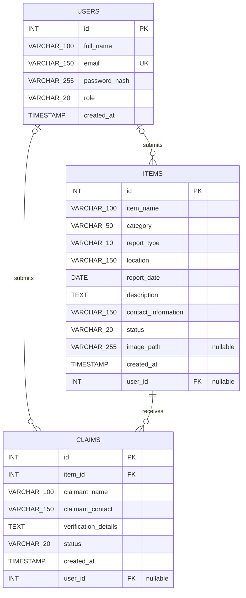
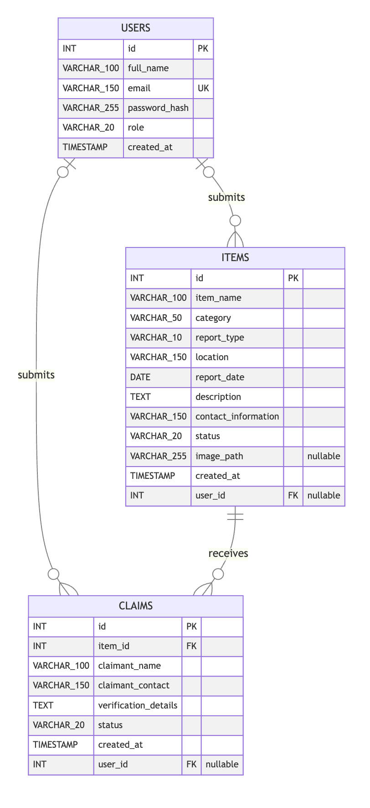

# Implemented Database Design

## 1. Database purpose

The Campus Lost and Found Platform uses MySQL to persist user accounts, lost-
and-found item reports, and claim requests. This document mirrors the fresh-
installation schema in [`database.sql`](../../database.sql). Existing
installations use the additive migration described below.

The `users` relationships were added by the lecturer-requested final scope
refinement. Both ownership columns are nullable only so every row created before
authentication remains valid. The final application requires login for
lost-and-found functionality and gives every new item and claim an owner.

## 2. Implemented tables and relationships

The database contains three tables, created in dependency order:

1. `users` stores registered user and administrator accounts;
2. `items` stores lost and found item reports; and
3. `claims` stores claim requests associated with an item.



### Final PNG export

[](images/final-erd.png)

The PNG above is the exported form of the authoritative Mermaid diagram and
reflects the current final schema.

The type labels use underscores because Mermaid attribute types cannot contain
parentheses. The tables below preserve the exact SQL declarations.

## 3. Users table

| Column | Exact SQL type/declaration | Nullability and default | Purpose |
|---|---|---|---|
| `id` | `INT AUTO_INCREMENT PRIMARY KEY` | Primary key; generated automatically | Identifies one account. |
| `full_name` | `VARCHAR(100) NOT NULL` | Not null | Stores the stripped registration or administrator name. |
| `email` | `VARCHAR(150) NOT NULL UNIQUE` | Not null; unique | Stores the normalized lowercase login email. |
| `password_hash` | `VARCHAR(255) NOT NULL` | Not null | Stores a Werkzeug password hash, never the raw password. |
| `role` | `VARCHAR(20) NOT NULL DEFAULT 'user'` | Not null; defaults to `user` | Distinguishes normal users from administrators. Public registration always supplies `user`; the local script supplies `admin`. |
| `created_at` | `TIMESTAMP DEFAULT CURRENT_TIMESTAMP` | Defaults to the current timestamp | Records account creation time. |

## 4. Items table

| Column | Exact SQL type/declaration | Nullability and default | Purpose |
|---|---|---|---|
| `id` | `INT AUTO_INCREMENT PRIMARY KEY` | Primary key; generated automatically | Identifies one item report. |
| `item_name` | `VARCHAR(100) NOT NULL` | Not null | Stores the reported item name. |
| `category` | `VARCHAR(50) NOT NULL` | Not null | Stores the selected category. |
| `report_type` | `VARCHAR(10) NOT NULL` | Not null | Distinguishes `lost` and `found` reports. |
| `location` | `VARCHAR(150) NOT NULL` | Not null | Stores where the item was lost or found and participates in keyword search. |
| `report_date` | `DATE NOT NULL` | Not null | Stores the date supplied on the report form. |
| `description` | `TEXT NOT NULL` | Not null | Stores the item description and participates in keyword search. |
| `contact_information` | `VARCHAR(150) NOT NULL` | Not null | Stores the reporter's supplied contact information. |
| `status` | `VARCHAR(20) NOT NULL DEFAULT 'active'` | Not null; defaults to `active` | Stores the displayed item status. |
| `image_path` | `VARCHAR(255)` | Nullable | Stores a relative path for an optional uploaded image. |
| `created_at` | `TIMESTAMP DEFAULT CURRENT_TIMESTAMP` | Defaults to the current timestamp | Supports newest-first ordering. |
| `user_id` | `INT NULL` | Nullable for migration compatibility | References the authenticated account that submitted the report. Current application inserts always provide this value; only pre-enhancement rows may remain `NULL`. |
| Foreign key | `FOREIGN KEY (user_id) REFERENCES users(id)` | Optional relationship | Enforces a valid owner when `user_id` is present. |

## 5. Claims table

| Column | Exact SQL type/declaration | Nullability and default | Purpose |
|---|---|---|---|
| `id` | `INT AUTO_INCREMENT PRIMARY KEY` | Primary key; generated automatically | Identifies one claim request. |
| `item_id` | `INT NOT NULL` | Not null | References the item being claimed. |
| `claimant_name` | `VARCHAR(100) NOT NULL` | Not null | Stores the stripped claim-form name. |
| `claimant_contact` | `VARCHAR(150) NOT NULL` | Not null | Stores the stripped claim-form contact value. |
| `verification_details` | `TEXT NOT NULL` | Not null | Stores the stripped ownership-verification message. |
| `status` | `VARCHAR(20) NOT NULL DEFAULT 'pending'` | Not null; defaults to `pending` | Stores the initial status assigned to a valid claim. |
| `created_at` | `TIMESTAMP DEFAULT CURRENT_TIMESTAMP` | Defaults to the current timestamp | Records when the claim was inserted. |
| `user_id` | `INT NULL` | Nullable for migration compatibility | References the authenticated account that submitted the claim. Current application inserts always provide this value; only pre-enhancement rows may remain `NULL`. |
| Foreign key | `FOREIGN KEY (item_id) REFERENCES items(id)` | Required relationship | Requires an existing item. |
| Foreign key | `FOREIGN KEY (user_id) REFERENCES users(id)` | Optional relationship | Enforces a valid account when `user_id` is present. |

## 6. Cardinality and legacy compatibility

- One user may own zero, one, or many item reports. Every report created by the
  final application has exactly one owner; only a pre-enhancement report may
  have no owner because the migrated column is nullable.
- One user may submit zero, one, or many claims. Every claim created by the
  final application has exactly one account; only a pre-enhancement claim may
  have no owner because the migrated column is nullable.
- Every claim references exactly one item through `claims.item_id`; an item may
  receive zero, one, or many claims.
- No cascade behavior is declared by the schema.
- **My Reports** filters strictly by the signed-in account's `user_id`; it does
  not guess ownership of legacy rows from names or contact details.
- The Admin Dashboard uses `LEFT JOIN`, so historical rows whose `user_id` is
  `NULL` remain visible under the legacy fallback labels.

## 7. Installation and one-time migration

For a fresh database, import [`database.sql`](../../database.sql). It creates
`users` before the two tables that reference it.

For an existing database that already contains `items` and `claims`, first take
a backup and then run the migration once against that database:

```bash
mysql -u <local-user> -p <database-name> \
  < migrations/001_add_user_admin_system.sql
```

[`001_add_user_admin_system.sql`](../../migrations/001_add_user_admin_system.sql)
creates `users`, adds both nullable ownership columns, and adds their foreign
keys. It does not remove or replace existing rows. It is a one-time migration,
not an application startup action, and Flask does not execute it automatically.

## 8. Field-to-feature mapping

| Delivered feature | Database fields used | Application mapping |
|---|---|---|
| Registration and login | `users.full_name`, `email`, `password_hash`, `role` | Registration inserts only `user`; login selects the account by normalized email and verifies the stored hash. |
| US01/US02 item reporting | Existing `items` fields plus `user_id` | Login is required and `save_item_report()` always stores the authenticated session account ID. |
| Browse/search/filter/details/photo | Existing `items` fields | The original US01-US07 behavior is unchanged. |
| US07 claim submission | Existing `claims` fields plus `user_id` | Login is required and `save_claim_request()` always stores the authenticated session account ID with `pending` status. |
| My Reports | `items.user_id` | `/my-reports` uses `WHERE user_id = %s` with the signed-in session ID. |
| Read-only Admin Dashboard | All three tables | `/admin` reads counts and uses `LEFT JOIN` queries to show registered and legacy item and claim records. |

The complete automated suite reports **95 passed** using fake or mocked
database connections; it does not require or prove a live MySQL installation.

## 9. Security and remaining schema limitations

- Password hashes fit within `VARCHAR(255)`; raw passwords are not database
  fields.
- Email uniqueness is enforced by MySQL in addition to the application's
  duplicate check.
- `role`, `report_type`, and status fields do not have database `CHECK`
  constraints.
- The read-only Admin Dashboard is not a US09 approval or rejection workflow.
- There is no status-history table, account verification token, password-reset
  token, or audit log.
- `image_path` references local file storage and does not prove that a safe file
  exists.
- Reporter contact information remains stored on item rows and displayed on the
  login-protected Item Details page.

## Historical Design Artifact


This original image is retained as planning evidence. It predates the final
schema and uses obsolete identifiers and claim fields. The Mermaid diagram and
exact tables above are authoritative for the implemented database.
