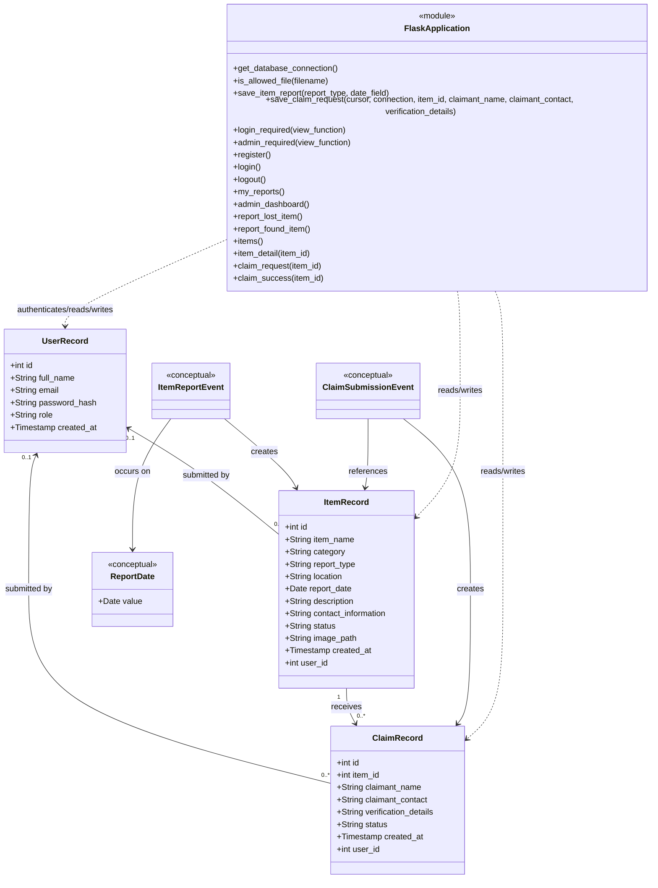
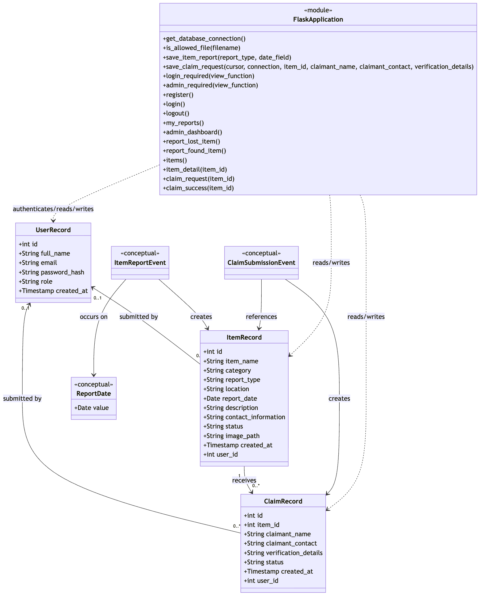

# Conceptual Domain Class Diagram and Implementation Mapping

## Purpose and scope

This diagram retains the instructor-requested Event and Date concepts as analysis and design elements while mapping them to the delivered Flask and MySQL implementation. `UserRecord`, `ItemRecord`, and `ClaimRecord` represent rows in the `users`, `items`, and `claims` tables. `ReportDate`, `ItemReportEvent`, and `ClaimSubmissionEvent` are conceptual only: the application does not instantiate Python classes for them.

The `UserRecord` and ownership links are the later refinement for the confirmed
lecturer request that the final version include a user system and an
administrator system for viewing lost-and-found records. The SQL columns remain
nullable to preserve pre-enhancement rows, but the final application requires
login and creates only owned item and claim records.

The project is function-based. `FlaskApplication` is therefore a diagram grouping for the routes and module-level helper functions in `app.py`, not a literal Python class. The diagram is an implementation mapping, not an inventory of Python classes.

## Authoritative conceptual diagram

### Final PNG export

The PNG above is the exported form of the authoritative Mermaid diagram and
reflects the current final system.

`image_path`, `ItemRecord.user_id`, and `ClaimRecord.user_id` are nullable in the
database. The two `user_id` fields reference `users.id`; their nullability
allows pre-enhancement records to remain unowned during migration. Current
application routes require login and always provide the authenticated user ID.
The other names above match the implemented columns; database nullability,
defaults, and foreign keys are documented in the database design.

## Implementation mapping

| Concept | Current implementation |
|---|---|
| `UserRecord` | One row in the MySQL `users` table. It stores a Werkzeug password hash and role; raw passwords are never stored. |
| `ItemRecord` | One row in the MySQL `items` table. |
| `ClaimRecord` | One row in the MySQL `claims` table; `claims.item_id` references `items.id`. |
| Legacy-compatible ownership | `items.user_id` and `claims.user_id` reference `users.id` for every new application record; `NULL` is retained only for pre-enhancement legacy rows. |
| `ReportDate` | The `items.report_date` `DATE` column populated from the `date-lost` or `date-found` form field. No `ReportDate` object exists at runtime. |
| `ItemReportEvent` | A conceptual report-submission event. A `POST` to `/report-lost-item` or `/report-found-item` is handled by `report_lost_item()` or `report_found_item()` and delegated to `save_item_report()`. No event object is instantiated. |
| `ClaimSubmissionEvent` | A conceptual claim-submission event. A `POST` to `/claim-request/<int:item_id>` is handled by `claim_request()` and delegated to `save_claim_request()`. No event object is instantiated. |
| `FlaskApplication` | The routes, decorators, and module-level helper functions in `app.py`; the codebase does not define this as a Python class. Registration/login/logout, My Reports ownership filtering, and the read-only administrator queries are function-based. |

The conceptual events do not own methods or participate in an inheritance hierarchy. Runtime validation, persistence, redirects, and rendering are performed by the Flask route and helper functions shown in the mapping.
