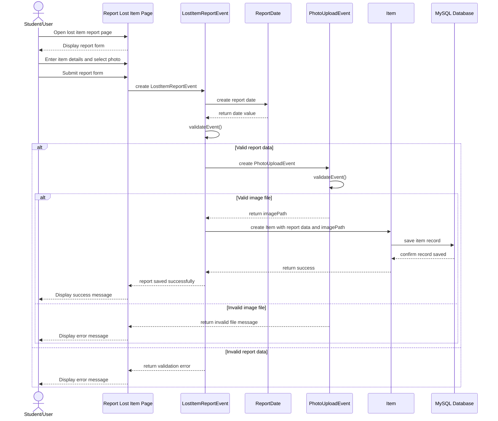

# Project Sequence Diagram

This sequence diagram illustrates the key operation of submitting a lost item report with an uploaded photo in the Campus Lost and Found Platform.

## Explanation

This sequence diagram applies the Date and Event structure from the class diagram to one key operation in the project.

When a student submits a lost item report with a photo, the system creates a `LostItemReportEvent`. The event is linked with a `ReportDate`, which records when the report happens. The system then validates the report data. If the report data is valid, a `PhotoUploadEvent` validates the uploaded image file. If the image is valid, the system returns an `imagePath`, creates an `Item` object, and saves the item record into the MySQL database.

The alternate path shows that if the uploaded file is invalid, the system returns an error message instead of saving the item.
