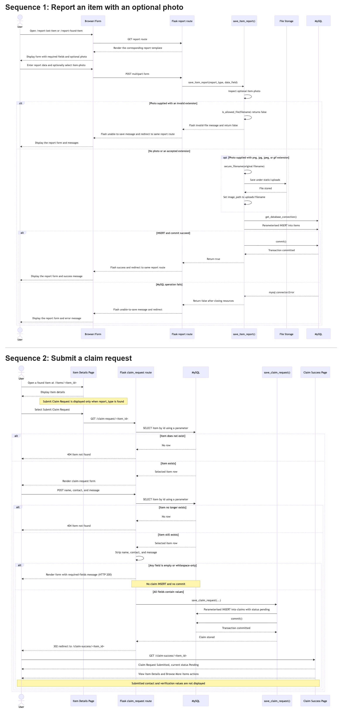
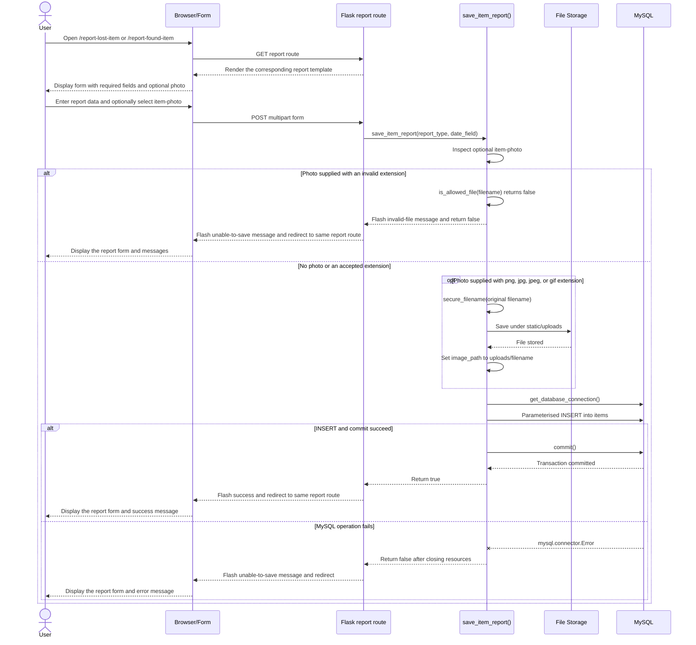
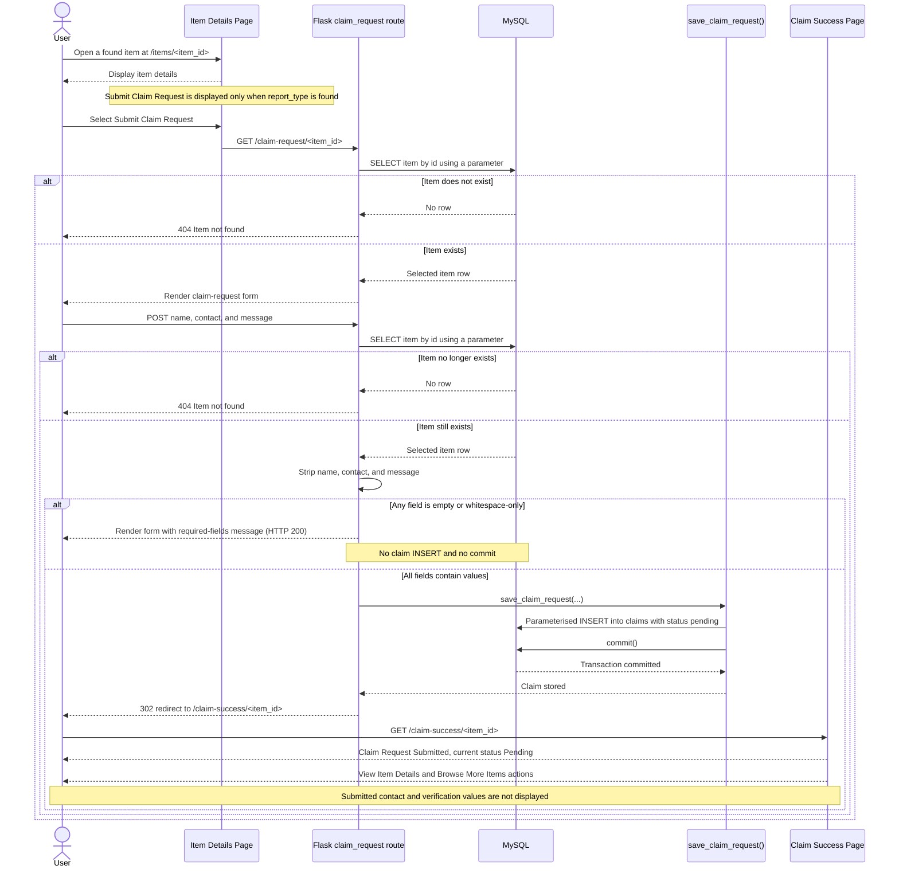

# Project Sequence Diagrams

These implementation-aligned sequences show how the delivered function-based Flask application reports an item and submits a claim request. They use the real routes, helpers, database operations, and response behaviour from `app.py`; conceptual Event and Date elements are not presented as runtime participants.

## Combined final PNG export

The PNG above combines the two authoritative Mermaid sequences below and
reflects the current final system.

## Sequence 1: Report an item with an optional photo

The lost-item and found-item routes share `save_item_report()`. Their route-specific values are `report_type` (`lost` or `found`) and the date form field (`date-lost` or `date-found`). The report templates mark the non-photo fields as HTML `required` fields, but `save_item_report()` accesses those values directly and does not perform an additional explicit empty-field validation pass.

When no file is supplied, `image_path` is inserted as `NULL`. File validation checks the filename extension only. The sequence does not imply MIME, size, filename-collision, or malware validation.

## Sequence 2: Submit a claim request

The Item Details template conditionally exposes the claim action for a found item. This is a user-interface eligibility rule only: a direct request to `/claim-request/<int:item_id>` loads any existing item, because `claim_request()` does not independently enforce `report_type == "found"`.
