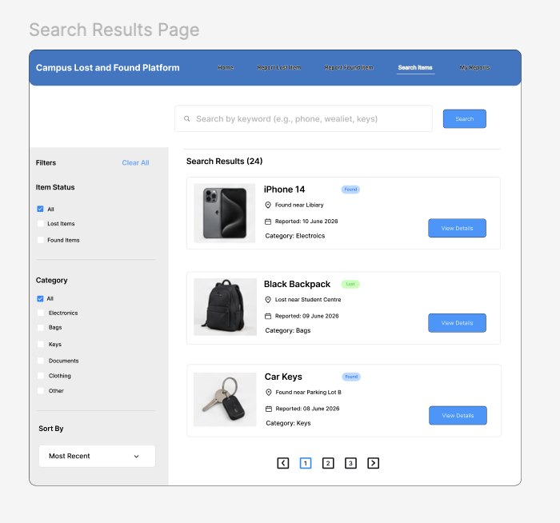
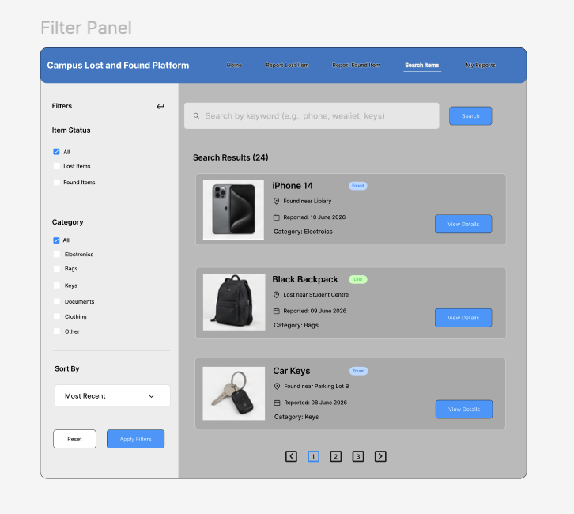
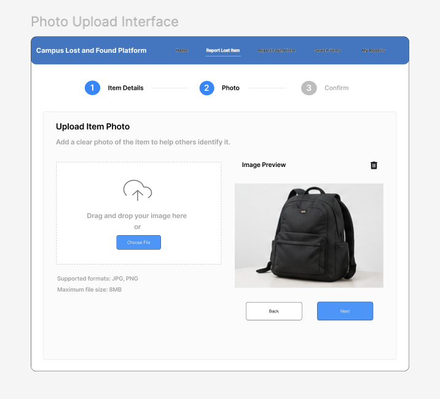
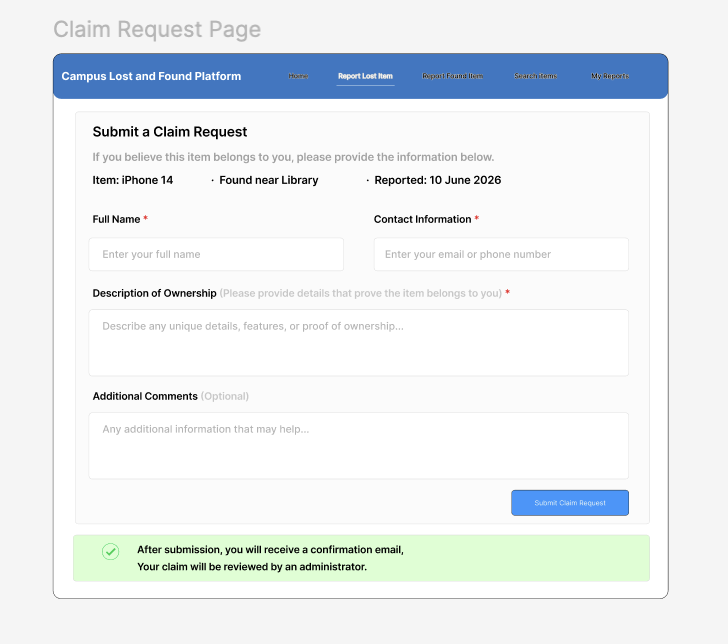

# User Interface Design

## Design Goal

The Campus Lost and Found Platform should provide a simple, modern, and user-friendly interface that allows university students to quickly report and locate lost property.

The design priorities are:

- Easy navigation
- Clear information display
- Fast form submission
- Mobile-friendly experience
- Consistent visual style

---

# Navigation

The navigation bar will appear at the top of every page.

Navigation links:

- Home
- Report Lost Item
- Report Found Item
- My Reports (Future)
- Search Items (Future)

Users should be able to move between pages with minimal clicks.

---

# Homepage

The homepage contains:

- Website title
- Navigation menu
- Welcome message
- Quick action buttons
  - Report Lost Item
  - Report Found Item
- Recently reported items section

The homepage should immediately communicate the purpose of the platform.

---

# Report Lost Item Page

The lost-item form includes:

- Item name
- Category
- Location lost
- Date lost
- Description
- Contact information

Required fields are clearly marked.

---

# Report Found Item Page

The found-item form includes:

- Item name
- Category
- Location found
- Date found
- Description
- Contact information

The layout should match the lost-item form for consistency.

---

# Item Details Page

The item details page displays:

- Item title
- Category
- Description
- Date
- Location
- Contact information

Information should be presented clearly and be easy to read.

---

# Search Results Page

The Search Results page allows users to search for lost and found items using keywords.

The page should display search results as item cards.

Each item card should contain:

* Item image
* Item name
* Category
* Location
* Date reported
* Report type (Lost or Found)

Users can click an item card to view the full item details page.

The page should support pagination when a large number of items are returned.

---

# Filter Panel

The filter panel helps users narrow down search results.

Available filters include:

* Lost Items
* Found Items
* Electronics
* Bags
* Keys
* Documents
* Other Categories

Users may apply multiple filters simultaneously.

On desktop devices, filters should appear on the left side of the page.

On mobile devices, filters should be displayed in a collapsible menu.

---

# Photo Upload Interface

Users reporting a lost or found item should be able to upload a photo.

The upload interface should include:

* Upload button
* Image preview
* Remove image option

Supported file formats:

* JPG
* PNG

Images help students identify items more accurately and improve matching success.

---

# Claim Request Page

Users who believe an item belongs to them may submit a claim request.

The claim form should include:

- Full name
- Contact information
- Description of ownership evidence
- Additional comments

After submission, users should receive a confirmation message.

The claim will then be reviewed by an administrator.

---

# My Reports Page (Future)

Users can:

- View submitted reports
- Edit reports
- Monitor report status

---

# Admin Review Page (Future)

Administrators can:

- Review claim requests
- Approve ownership claims
- Update item status

---

# Mobile-Friendly Design

The website should support:

- Responsive layouts
- Mobile navigation
- Touch-friendly buttons
- Readable text sizes

This is important because many students access websites using smartphones.

---

## Search Results Prototype

---

## Filter Panel Prototype

---

## Photo Upload Prototype

---

## Claim Request Prototype

---

## Design Tools

The interface prototypes were created using Figma.

Figma design files were used to plan page layouts, navigation structures, and user interactions before implementation.

Figma Prototype Link: https://www.figma.com/design/uW6BKB70chZFDM6twSy4H9/Untitled?node-id=0-1&t=JADnl2OYpQjxtCNL-1

---

# Conclusion

The interface design focuses on simplicity, clarity, and usability to ensure that university students can efficiently report and recover lost items.

Iteration 2 extends the design by introducing search functionality, filtering tools, photo uploads, and claim request workflows to improve the overall user experience.