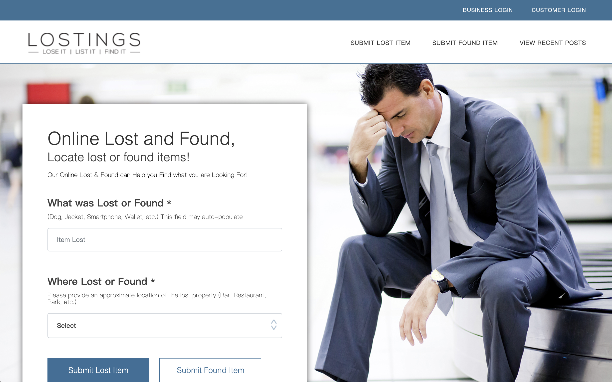
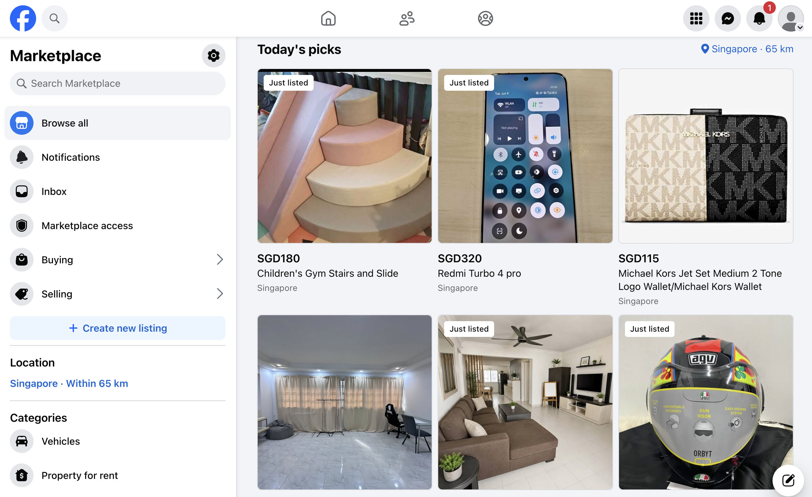
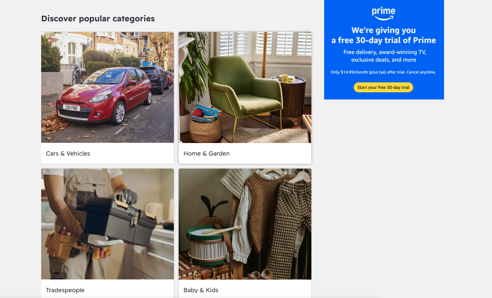

# UI Inspiration

This page records interface inspiration collected from similar lost-and-found platforms.

---

# Inspiration 1

## Platform or Website Name
Lostings (Lost and Found Platform)

## Useful Features
- Clean homepage layout
- Search bar on top
- Category filters
- Item cards with images
- Easy navigation

## What We Can Learn
For our Campus Lost and Found Platform, we can use a similar card-based layout to display lost and found items. The search bar should be visible on the homepage to help users find items quickly.

---

# Inspiration 2

## Platform or Website Name
Facebook Marketplace

## Useful Features
- Large item images
- Clear item details
- Simple category navigation
- Mobile-friendly interface

## What We Can Learn
Large item images can help users identify lost property more easily. The responsive design is also useful because many university students access websites using mobile devices.

---

# Inspiration 3

## Platform or Website Name
Gumtree

## Useful Features
- Clean item listing layout
- Search and filtering functions
- Detailed item information page
- Easy-to-use forms

## What We Can Learn
Our project can adopt a similar search and filter mechanism. Detailed item pages will allow users to view descriptions, locations, and contact information clearly.

---

# Summary

The common design ideas identified from these platforms include:

- Simple navigation
- Search functionality
- Category filtering
- Card-based item display
- Clear item details pages
- Mobile-friendly layouts

These ideas will guide the design of the Campus Lost and Found Platform.