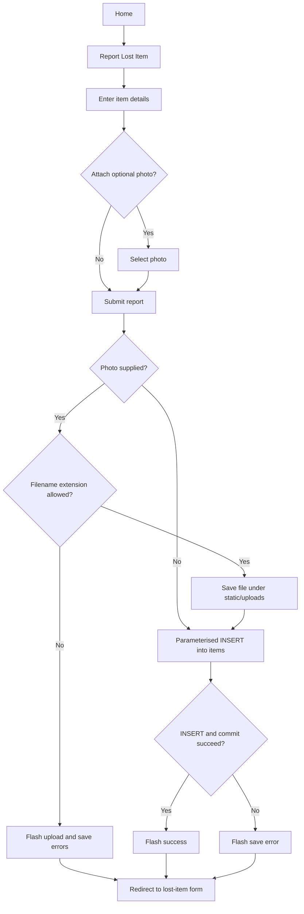
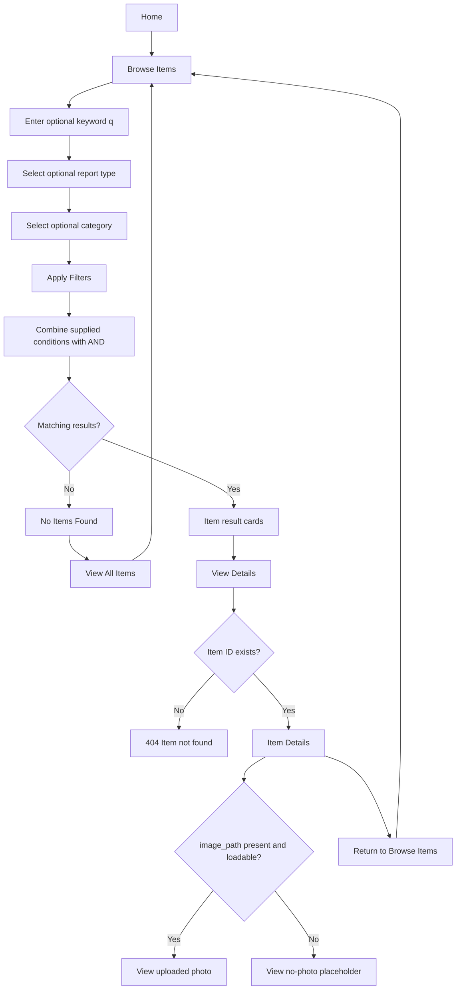
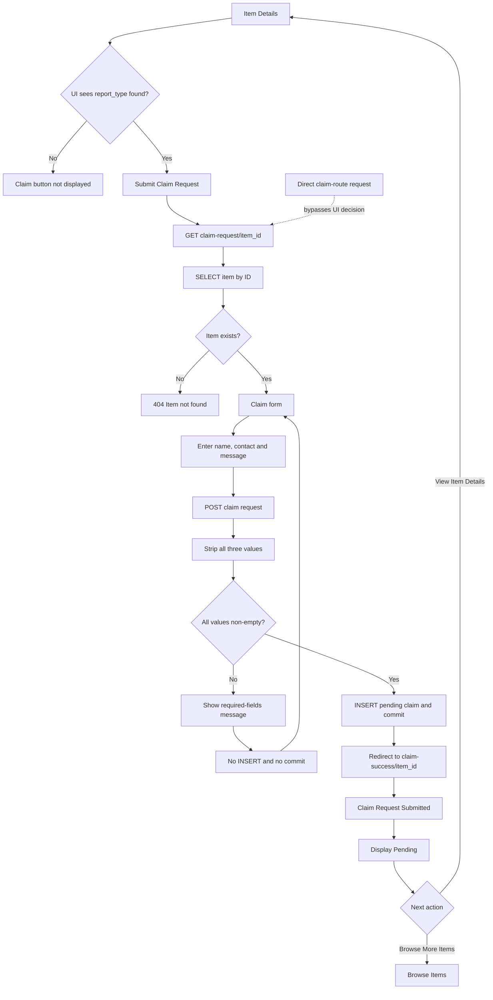

# Implemented User Flows

This document records the delivered navigation and request outcomes. The Mermaid flowcharts are authoritative for the current Flask implementation.

## 1. Report Lost Item

The form sends a multipart `POST` to `/report-lost-item`. Item Name, Category, Location Lost, Date Lost, Description and Contact Information are browser-required; the photo is optional. The handled success, invalid-extension and database-error paths redirect back to the same form with feedback.

## 2. Report Found Item

The form sends a multipart `POST` to `/report-found-item`. Its required fields mirror the lost-item form, and the optional photo follows the same extension-based upload path.

## 3. Browse, search, filter and view details

The keyword searches item name, description and location. Report type and category are single-choice selectors. The page has no pagination or multi-category filter.

## 4. Submit Claim Request

The Item Details template makes the found-only decision for the visible claim button. The backend `/claim-request/<int:item_id>` route verifies that the item exists but does not independently enforce `report_type = found`; a direct request can therefore bypass the UI eligibility boundary.

The success screen is a separate `/claim-success/<int:item_id>` page. It shows Pending and links to the selected Item Details page or back to Browse Items, without displaying the submitted private form values.

## Historical design artifact

The image is retained as an earlier planning artefact. It omits the delivered browse/search/filter, photo fallback, validation, 404 and dedicated claim-success paths, so it is not the authoritative current flow.
