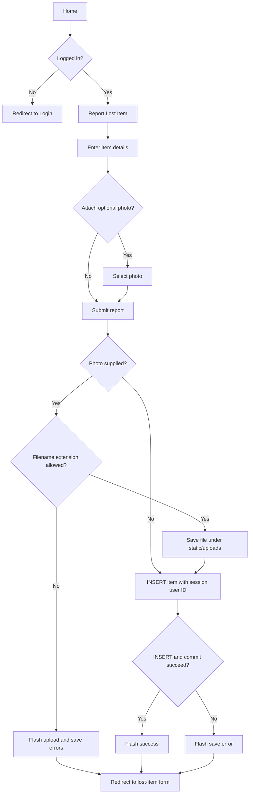
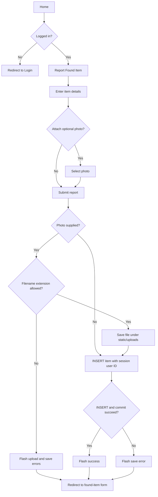
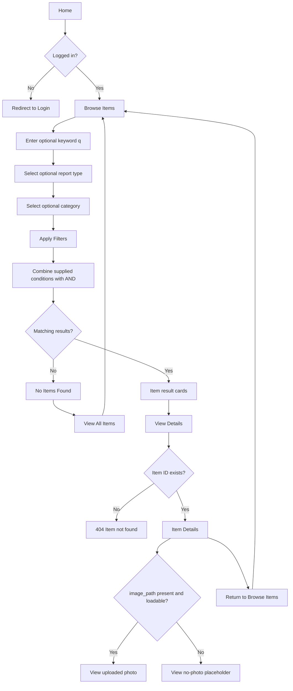
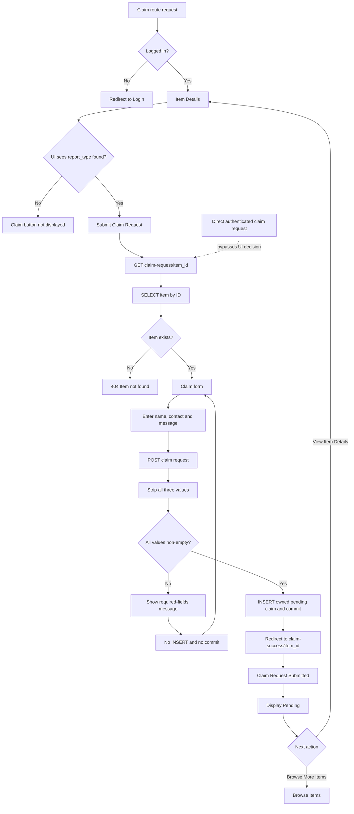
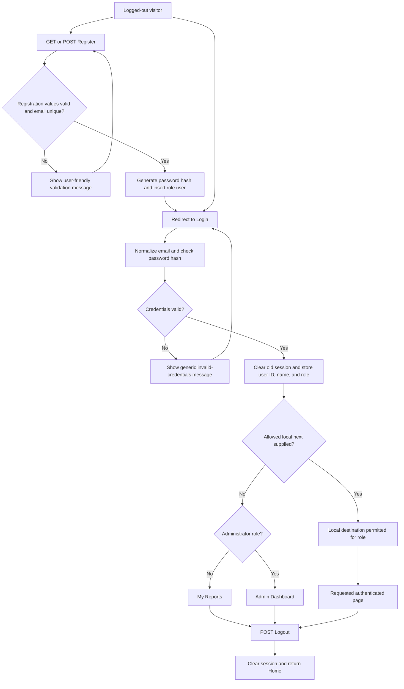
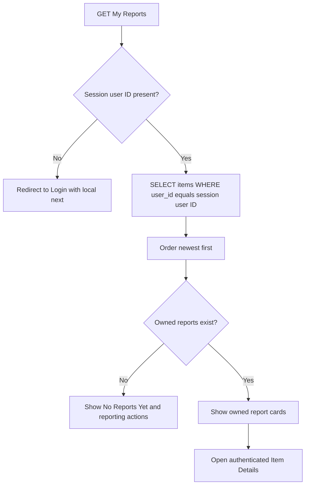
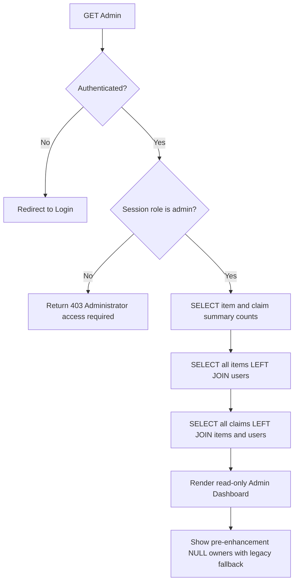
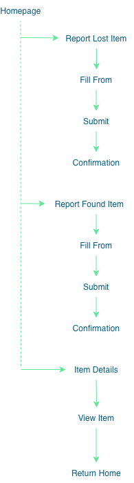

# Implemented User Flows

This document records the delivered navigation and request outcomes. The Mermaid
flowcharts are authoritative for the current Flask implementation. Sections
1–4 retain the US01-US07 behavior behind the final login guard; Sections 5–7
document the account and viewing refinement. Earlier evidence of unauthenticated
baseline operation remains historical rather than describing current access.

## 1. Report Lost Item

`/report-lost-item` requires login. The form sends a multipart `POST`; the
handled success, invalid-extension and database-error paths redirect back to the
same form with feedback. Every successful item insert stores the required
session user ID.

## 2. Report Found Item

`/report-found-item` requires login. Its required fields mirror the lost-item
form, and the optional photo follows the same extension-based upload path. Every
successful insert is owned by the authenticated account.

## 3. Browse, search, filter and view details

The Browse, search/filter, generic details entry, and selected Item Details
routes require login. The keyword searches item name, description and location.
Report type and category are single-choice selectors. The page has no
pagination or multi-category filter.

## 4. Submit Claim Request

Login is required for the claim request and claim-success routes. The Item
Details template makes the found-only decision for the visible claim button.
The backend verifies that the item exists but does not independently enforce
`report_type = found`; an authenticated direct request can therefore bypass the
UI eligibility boundary.

The success screen is a separate login-protected page. It shows Pending and
links to Item Details or Browse Items without displaying submitted private
values. Every new claim stores the authenticated session user ID.

## 5. Register, log in, and log out

The safe-return check accepts local absolute paths only and rejects external or scheme-relative destinations. A normal user cannot use `next` to enter `/admin`. Public registration cannot create an administrator; the interactive `scripts/create_admin.py` script is the separate administrator-account path.

## 6. View My Reports

The filter uses only the authenticated session user ID. It never accepts another user's ID from a URL or form. An administrator may use My Reports, but receives the same own-account filter.

## 7. View administrator records

The dashboard exposes viewing only. It has no POST route and no delete, ban,
approval, rejection, or status-update action. `LEFT JOIN` keeps all
pre-enhancement records with `NULL` ownership visible; current application
submissions are always owned.

## Historical design artifact

The image is retained as an earlier planning artefact. It omits the delivered browse/search/filter, photo fallback, validation, 404 and dedicated claim-success paths, so it is not the authoritative current flow.
