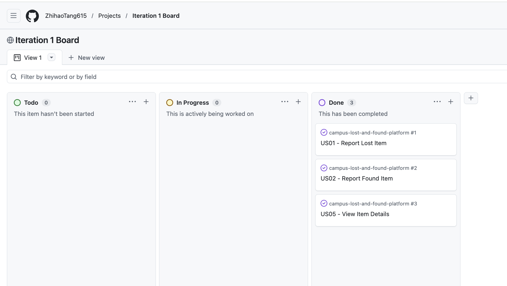
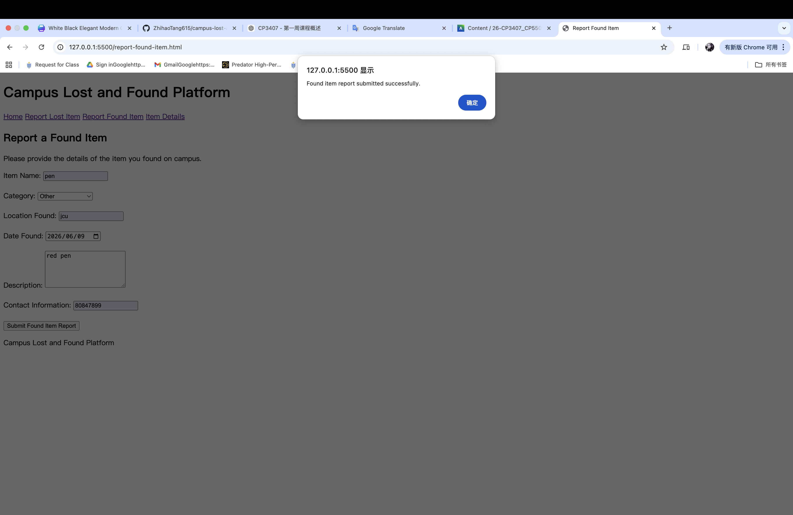
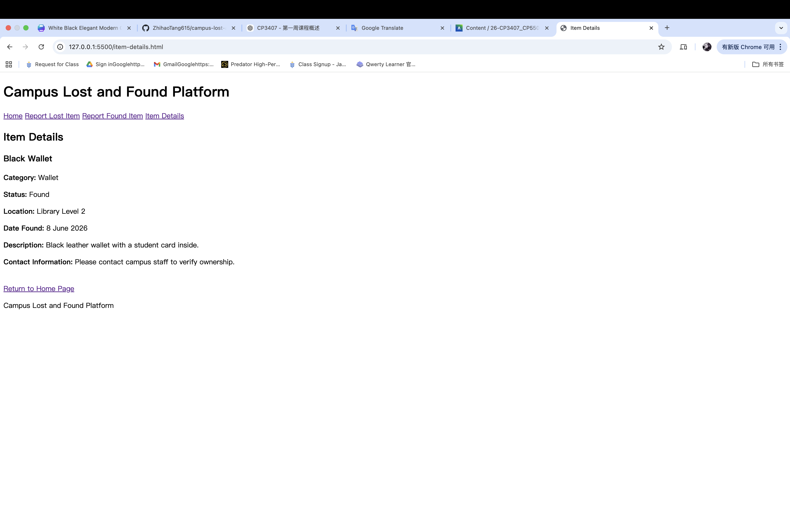

# Iteration 1 Review

## Overview

Iteration 1 focused on implementing the core reporting and item-detail services for the Campus Lost and Found Platform.

## Completed User Stories

- US01 - Report Lost Item
- US02 - Report Found Item
- US05 - View Item Details

## GitHub Project Board

## Runnable Prototype

### Homepage

### Report Lost Item

### Report Found Item

### View Item Details

## Current Limitations

The Iteration 1 prototype provides a runnable front-end interface. The submitted report data is not yet stored in a database. Database integration will be implemented in a later iteration.

## Next Steps

- Collect client feedback on the Iteration 1 prototype.
- Improve the user interface based on feedback.
- Design the database structure.
- Begin backend and database integration.
