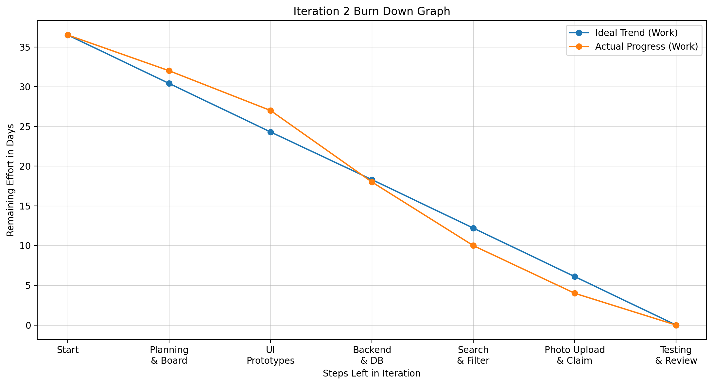

# Iteration 2 Review

## Overview

Iteration 2 focused on improving the usability and functionality of the Campus Lost and Found Platform. Based on the Iteration 1 feedback, the team added search, filter, photo upload, and claim request features. This iteration also included backend and database integration work to make the prototype more functional.

## Completed User Stories

The following user stories were completed during Iteration 2:

- **US03 – Search Items**
- **US04 – Filter Items**
- **US06 – Upload Item Photo**
- **US07 – Submit Claim Request**

These user stories improved the platform by allowing users to search for relevant items, narrow results using filters, upload photos for easier identification, and submit a claim request for a found item.

## Team Contributions

### Zhihao Tang

**Role:** Technical Lead / Full-Stack Developer

Main contributions:

- Designed the MySQL database schema.
- Set up the Flask backend.
- Connected report forms to the database.
- Created the dynamic item list.
- Connected the dynamic Item Details page.
- Implemented search and filter functionality.
- Implemented photo upload and claim request workflow.
- Supported integration testing.

### Jingyang Cai

**Role:** UI/UX Designer / Design Documentation Lead

Main contributions:

- Created the search results page prototype.
- Created the filter panel prototype.
- Created the photo upload interface prototype.
- Created the claim request page prototype.
- Created the database ER diagram.
- Updated the UI and database design documentation.

### Sihan Zhong

**Role:** Requirements Analyst / Client Feedback Coordinator / Testing Lead

Main contributions:

- Prepared the Iteration 2 plan.
- Updated the acceptance test cases.
- Collected client feedback from three students.
- Summarised client feedback findings.
- Prepared the Iteration 2 burn-down graph.
- Prepared the Iteration 2 review documentation.
- Maintained Project Board evidence.

## GitHub Project Board

The Iteration 2 Project Board was used to track user stories, technical tasks, design tasks, and documentation tasks.

### Iteration 2 Board Start

### Iteration 2 Board Final

## Runnable Prototype

The Iteration 2 runnable prototype included the main new features planned for this iteration.

### Search Items

The search function allows users to enter keywords and find matching lost or found item reports.

### Filter Items

The filter function allows users to narrow item results by options such as category, location, or item status.

### Upload Item Photo

The photo upload function allows users to attach an image when submitting a lost or found item report.

### Submit Claim Request

The claim request function allows users to submit information when they believe a found item belongs to them.

## Client Feedback Summary

The Iteration 2 prototype was demonstrated to three university students. The feedback focused on three main areas: functionality, appearance, and reasonableness of the user flow.

Overall, the participants agreed that the Iteration 2 prototype was more useful than the Iteration 1 version. They found the search and filter functions helpful for locating items more quickly. They also felt that photo upload made item identification easier and that the claim request process matched the purpose of a campus lost and found platform.

The main suggestions were:

- Improve spacing between forms, buttons, and item cards.
- Make colours and button styles more consistent.
- Add clearer confirmation messages after submitting a report or claim request.
- Add claim-status tracking in the next iteration.
- Allow users to view their own submitted reports.

The full feedback record is available in:

[`../client-feedback/iteration-2-feedback.md`](../client-feedback/iteration-2-feedback.md)

## Acceptance Testing Summary

Acceptance testing was completed for the Iteration 2 user stories: US03, US04, US06, and US07.

The tests covered:

- Searching for matching items
- Searching for non-existing items
- Filtering items by category and location
- Clearing filters
- Uploading valid and invalid files
- Submitting claim requests
- Blocking incomplete claim request forms
- Testing the full workflow from report submission to claim request

A total of **10 acceptance tests** were completed. **10 tests passed** and **0 tests failed**. No major issues were found during acceptance testing.

The full acceptance testing record is available in:

[`../testing/acceptance-tests.md`](../testing/acceptance-tests.md)

## Iteration 2 Burn Down Graph

The graph below compares the ideal trend with the actual progress during Iteration 2. The iteration started with an estimated workload of 36.5 person-days. The remaining effort decreased as planning, UI design, backend development, search and filter implementation, photo upload, claim request, testing, and review tasks were completed.

## Current Limitations

Although Iteration 2 added important functionality, some limitations remain:

- Claim status tracking has not yet been fully implemented.
- Users cannot yet view a personal list of their submitted reports.
- Claim requests still need a clearer review or approval process.
- The interface could be improved with more consistent spacing, colours, and button styles.
- Further testing is needed with more users and more realistic item data.

## Main Improvements Planned for Iteration 3

Iteration 3 should focus on improving the claim management process and user report tracking.

The planned improvements are:

1. Add claim-status tracking so users can see whether a claim is pending, approved, rejected, or completed.
2. Add a review process for claim requests.
3. Allow item status to be updated after an item is claimed or returned.
4. Allow users to view their own submitted reports.
5. Improve confirmation messages after form submissions.
6. Improve the visual consistency of the interface.

These improvements support the planned Iteration 3 user stories:

- **US08 – Track Claim Status**
- **US09 – Review Claim Requests**
- **US10 – Update Item Status**
- **US11 – View My Submitted Reports**

## Conclusion

Iteration 2 successfully extended the Campus Lost and Found Platform from a basic runnable prototype into a more functional system. The new search, filter, photo upload, and claim request features improved the usefulness of the platform. Client feedback and acceptance testing showed that the main functions were understandable and usable. The next iteration should focus on claim tracking, claim review, item status updates, and user report management.
