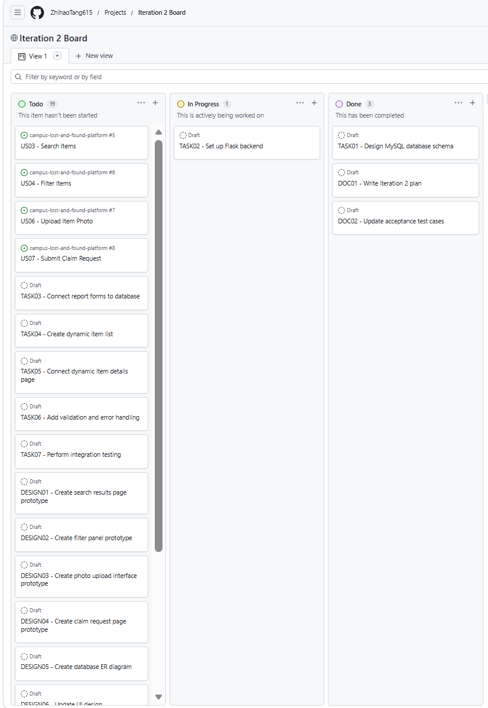
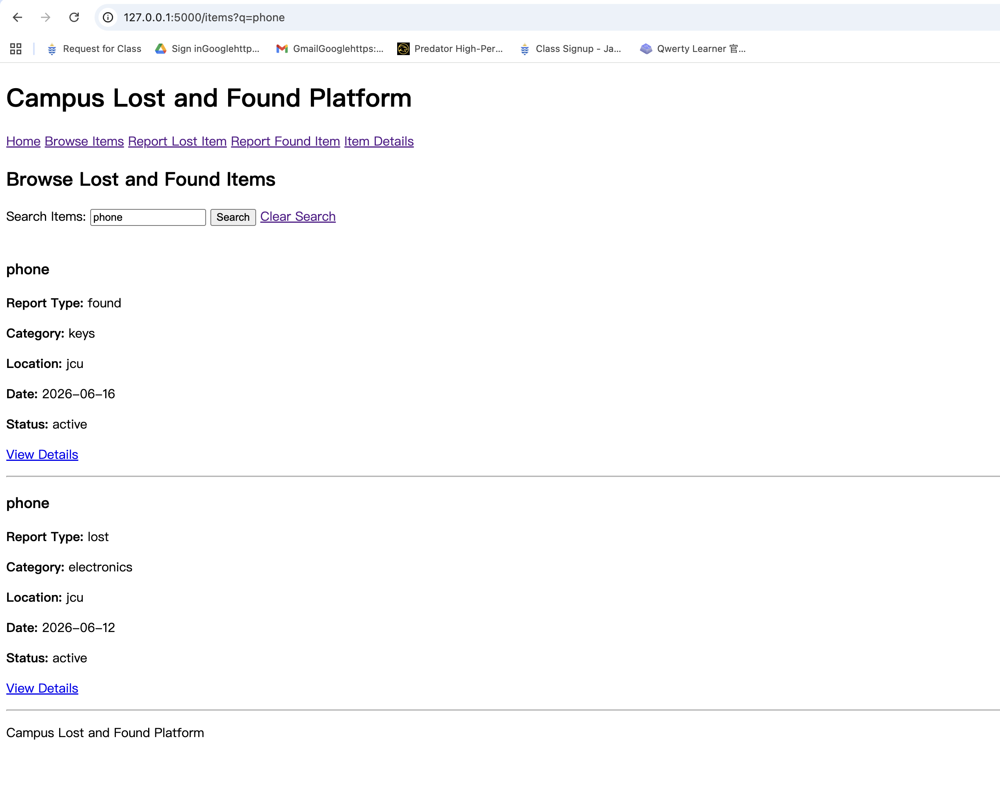
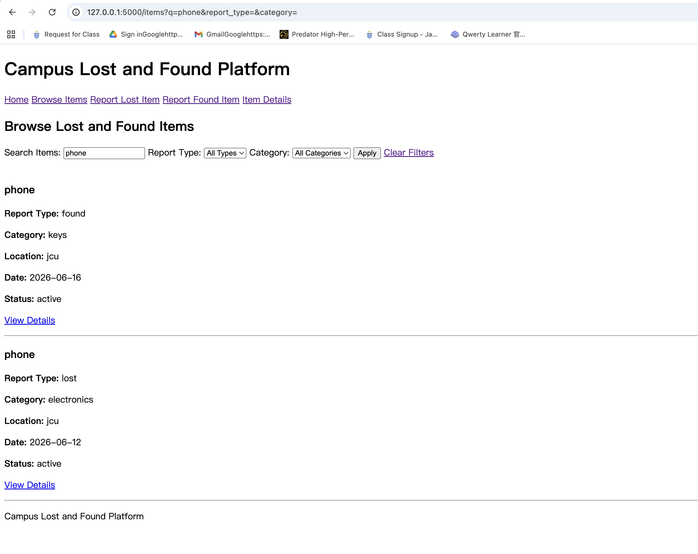
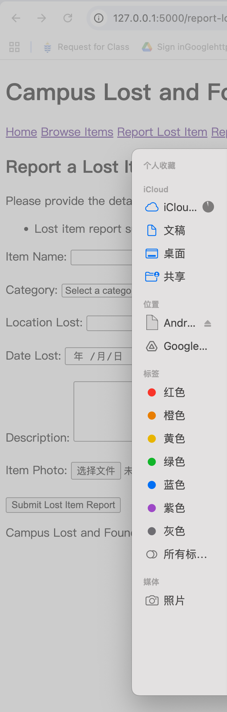
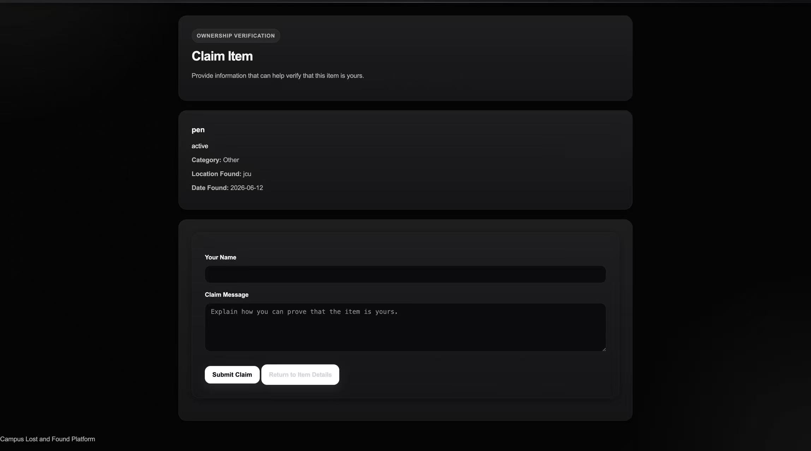

# Iteration 2 Review

## Overview

Iteration 2 ran from Week 5 to the end of Week 7 and selected search, filter, photo-upload, and claim-request user stories. The iteration also included backend, database, interface, testing, and documentation work. At the deadline, only US03 Search Items was completed end-to-end; US04, US06, and US07 continued as carry-over work.

## Iteration 2 User-Story Outcome

| User Story | Original estimate | Deadline outcome |
|---|---:|---|
| **US03 – Search Items** | 2 person-days | Completed end-to-end |
| **US04 – Filter Items** | 3 person-days | Carry-over |
| **US06 – Upload Item Photo** | 5 person-days | Carry-over |
| **US07 – Submit Claim Request** | 4 person-days | Carry-over |
| **Total** | **14 person-days** | **2 completed; 12 remaining** |

US03 was the only user story that met the end-to-end completion criterion by the Iteration 2 deadline. Development and prototype evidence existed for US04, US06, and US07, but those stories were not counted as completed Iteration 2 user-story effort.

## Velocity Summary

Iteration 2 lasted three weeks, with five working days per week and three team members:

```text
3 weeks × 5 working days = 15 working days
15 working days × 3 team members = 45 person-days theoretical capacity
```

| Measure | Calculation | Result |
|---|---|---:|
| Planned user-story effort | `2 + 3 + 5 + 4` | 14 person-days |
| Completed user-story effort | US03 | 2 person-days |
| Remaining planned effort | `14 - 2` | 12 person-days |
| Actual completed-work velocity | `2 ÷ 45` | `0.0444`; **0.04 rounded; 4.44%** |
| Planned capacity utilisation | `14 ÷ 45` | `0.3111`; **0.31 rounded; 31.11%** |

The `0.04` figure is actual completed-work velocity. The separate `0.31` figure is planned capacity utilisation and must not be described as actual velocity.

## Team Contributions

### Zhihao Tang

**Role:** Technical Lead / Full-Stack Developer

Main contributions:

- Designed the MySQL database schema.
- Set up the Flask backend.
- Connected report forms to the database.
- Created the dynamic item list.
- Connected the dynamic Item Details page.
- Implemented search and worked on filter functionality.
- Worked on the photo-upload and claim-request workflows.
- Supported integration testing.

### Jingyang Cai

**Role:** UI/UX Designer / Design Documentation Lead

Main contributions:

- Created the search results page prototype.
- Created the filter panel prototype.
- Created the photo upload interface prototype.
- Created the claim request page prototype.
- Created the database ER diagram.
- Updated the UI and database design documentation.

### Sihan Zhong

**Role:** Requirements Analyst / Client Feedback Coordinator / Testing Lead

Main contributions:

- Prepared the Iteration 2 plan.
- Updated the acceptance test cases.
- Collected client feedback from three students.
- Summarised client feedback findings.
- Prepared the Iteration 2 burn-down graph.
- Prepared the Iteration 2 review documentation.
- Maintained Project Board evidence.

These contribution records describe work performed during the iteration. Entries relating to US04, US06, and US07 do not imply that those stories were completed end-to-end by the deadline.

## GitHub Project Board

The Iteration 2 Project Board was used to track user stories, technical tasks, design tasks, and documentation tasks.

### Iteration 2 Board Start



### Later Week 6 Board Status

The separately named `iteration-2-board-final.png` artifact is not present in
the current repository. The closest tracked later Iteration 2 Board snapshot is:


## Prototype and Work-in-Progress Evidence

The following screenshots are retained as historical prototype and work-in-progress evidence. They do not override the deadline completion assessment above.

### Search Items

US03 Search Items was completed end-to-end and allowed keyword searches for matching lost or found item reports.



### Filter Items

This screenshot records Iteration 2 filter work. US04 was not completed end-to-end by the deadline and continued as carry-over work.



### Upload Item Photo

This screenshot records Iteration 2 photo-upload work. US06 was not completed end-to-end by the deadline and continued as carry-over work.



### Submit Claim Request

This screenshot records Iteration 2 claim-request work. US07 was not completed end-to-end by the deadline and continued as carry-over work.



## Client Feedback Summary

The Iteration 2 prototype was demonstrated to three university students. The feedback focused on three main areas: functionality, appearance, and reasonableness of the user flow.

Overall, the participants agreed that the Iteration 2 prototype was more useful than the Iteration 1 version. They found the search and filter functions helpful for locating items more quickly. They also felt that photo upload made item identification easier and that the claim request process matched the purpose of a campus lost and found platform.

The main suggestions were:

- Improve spacing between forms, buttons, and item cards.
- Make colours and button styles more consistent.
- Add clearer confirmation messages after submitting a report or claim request.
- Add claim-status tracking in the next iteration.
- Allow users to view their own submitted reports.

The full feedback record is available in:

[`../client-feedback/iteration-2-feedback.md`](../client-feedback/iteration-2-feedback.md)

## Historical Acceptance Testing Summary

The existing Iteration 2 acceptance-test record contains checks associated with US03, US04, US06, and US07.

The tests covered:

- Searching for matching items
- Searching for non-existing items
- Filtering items by category and location
- Clearing filters
- Uploading valid and invalid files
- Submitting claim requests
- Blocking incomplete claim request forms
- Testing the full workflow from report submission to claim request

The historical record reports **10 tests**, **10 passed**, and **0 failed**. These individual prototype and workflow test results are retained as evidence of testing activity; they do not establish that US04, US06, and US07 met the end-to-end completion criterion by the Iteration 2 deadline.

The full acceptance testing record is available in:

[`../testing/Iteration 2 Acceptance Tests-tests.md`](../testing/Iteration%202%20Acceptance%20Tests-tests.md)

## Iteration 2 Burn Down Graph

The historical graph below starts from `36.5 person-days` and may include broader task-level work such as planning, interface design, implementation, testing, documentation, and review. It is retained as historical evidence, but `36.5 person-days` is not the user-story numerator used for the velocity calculation.

On the confirmed user-story basis, Iteration 2 selected 14 person-days, completed 2 person-days end-to-end, and retained 12 person-days as carry-over. Theoretical team capacity was 45 person-days. These user-story and capacity measures must not be mixed with the broader historical burn-down measure.


## Current Limitations

Although Iteration 2 produced useful development and prototype work, some limitations remained:

- Claim status tracking has not yet been fully implemented.
- Users cannot yet view a personal list of their submitted reports.
- Claim requests still need a clearer review or approval process.
- The interface could be improved with more consistent spacing, colours, and button styles.
- Further testing is needed with more users and more realistic item data.

## Main Improvements Planned for Iteration 3

US04, US06, and US07 first required carry-over completion. The existing historical Iteration 3 plan also focused on improving the claim-management process and user-report tracking.

The planned improvements are:

1. Add claim-status tracking so users can see whether a claim is pending, approved, rejected, or completed.
2. Add a review process for claim requests.
3. Allow item status to be updated after an item is claimed or returned.
4. Allow users to view their own submitted reports.
5. Improve confirmation messages after form submissions.
6. Improve the visual consistency of the interface.

These improvements support the planned Iteration 3 user stories:

- **US08 – Track Claim Status**
- **US09 – Review Claim Requests**
- **US10 – Update Item Status**
- **US11 – View My Submitted Reports**

## Conclusion

Iteration 2 completed US03 Search Items end-to-end, representing 2 person-days of completed user-story effort. US04 Filter Items, US06 Upload Item Photo, and US07 Submit Claim Request produced development or prototype evidence but remained carry-over work, leaving 12 of the 14 planned person-days incomplete at the deadline. The historical feedback, testing, Board, and screenshot evidence remains part of the iteration record without being treated as proof that all four stories were completed.
