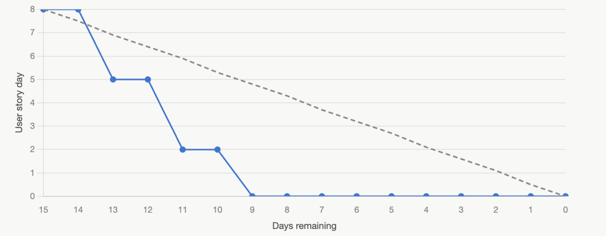

# Week 6 Practical Reflection

## Context

Our team is currently working on Iteration 2 of the Campus Lost and Found Platform.

Practical 6 focuses on reflecting on Iteration 1 and using the result to adjust the Iteration 2 backlog and task tracking. The main purpose is to make sure our Iteration 2 plan is realistic based on the actual velocity from Iteration 1.

This practical also connects with the Week 6 topic of version control. Our team uses GitHub commits, branches, issues, pull requests, and the project board to track changes and manage development work.

---

## 1. Actual Velocity of Iteration 1

Iteration 1 included the following completed user stories:

| User Story | Description | Estimate | Status |
|---|---|---:|---|
| US01 - Report Lost Item | Users can submit a lost item report | 3 person-days | Completed |
| US02 - Report Found Item | Users can submit a found item report | 3 person-days | Completed |
| US05 - View Item Details | Users can view item details | 2 person-days | Completed |

### Velocity Calculation

Actual Velocity = 3 + 3 + 2

Actual Velocity = 8 person-days

### Result

The actual velocity of Iteration 1 was **8 person-days**.

Only completed Iteration 1 user stories were included in this calculation.

### Iteration 1 Burndown Rate Graph

The Iteration 1 burndown rate graph shows the remaining work across Iteration 1. The planned workload for Iteration 1 was 8 person-days, based on the completed user stories: US01 - Report Lost Item, US02 - Report Found Item, and US05 - View Item Details.

The graph compares the ideal burndown line with the actual team progress. The ideal line shows the expected steady reduction of remaining work across the iteration. The actual line shows that the remaining work did not decrease every day because work was reduced when completed user stories were finished.

By the end of Iteration 1, all planned user stories were completed and the remaining work reached 0.



---

## 2. SRP and DRY Review

The team reviewed the main classes using the Single Responsibility Principle and the DRY principle.

### SRP Review

| Class | Main Responsibility | SRP Finding |
|---|---|---|
| User | Stores user information and allows users to submit reports or claim requests | Mostly satisfies SRP because it focuses on user-related actions |
| Item | Stores common lost and found item information | Satisfies SRP if it only manages item details and item status |
| LostItemReport | Records lost item report details | Satisfies SRP because it focuses on the lost item reporting process |
| FoundItemReport | Records found item report details | Satisfies SRP because it focuses on the found item reporting process |
| Photo | Manages uploaded item photo information | Satisfies SRP because it only handles photo-related information |
| ClaimRequest | Manages claim request information and claim status | Satisfies SRP because it focuses on the claim workflow |
| Admin | Reviews claim requests and updates item status | Satisfies SRP because it focuses on administrative review actions |

### SRP Findings

The design mostly satisfies SRP because each class has a clear responsibility.

The Item class should only store common item information such as item name, report type, category, location, date, description, photo path, contact information, and status.

The Item class should not directly handle claim review, admin actions, or user account management.

The Photo class should manage uploaded photo information separately.

The ClaimRequest class should manage claim request data and claim status.

The Admin class should handle review actions, such as approving or rejecting claim requests.

---

### DRY Review

The DRY principle means that repeated information and repeated logic should be avoided.

Lost item reports and found item reports share many common fields, including:

- item name
- category
- description
- location
- date
- photo
- status
- contact information

To avoid repetition, these common fields should be stored in the Item class. LostItemReport and FoundItemReport should only store report-specific details.

### DRY Findings

Our team identified the following DRY points:

1. Lost item reports and found item reports share common item fields.
2. Search and filter should use the same item data source instead of duplicated item lists.
3. Photo upload logic should not be repeated separately in multiple report classes.
4. Item details should reuse item data instead of creating a separate duplicated details structure.

### Design Decision

We decided to keep common item information in the Item class. LostItemReport and FoundItemReport keep only report-specific details. Photo upload is handled separately, and claim request logic is handled by the ClaimRequest class.

This design is good enough for the current prototype because it is clear, maintainable, and supports the main features needed for Iteration 2.

---

## 3. Updating Iteration 2 Backlog Using Iteration 1 Velocity

The actual velocity of Iteration 1 was 8 person-days. Therefore, our Iteration 2 backlog should stay close to 8 person-days to avoid overcommitting.

The adjusted Iteration 2 backlog is:

| User Story | Description | Estimate | Priority |
|---|---|---:|---|
| US03 - Search Items | Users can search for lost and found items | 2 person-days | High |
| US04 - Filter Items | Users can filter items by report type and category | 2 person-days | High |
| US06 - Upload Item Photo | Users can upload an item photo when submitting a report | 2 person-days | High |
| US07 - Submit Claim Request | Users can submit a claim request for a found item | 2 person-days | High |

### Total Planned Work

Total planned Iteration 2 workload = 2 + 2 + 2 + 2

Total planned Iteration 2 workload = 8 person-days

This matches the actual velocity from Iteration 1.

### Planning Decision

Based on the Iteration 1 velocity, our team decided to focus on the four main Iteration 2 user stories first. Advanced features, such as admin dashboard improvements, automatic notifications, claim history, and full image display in every page, can be moved to the next iteration if they cannot be completed within the current iteration.

---

## 4. Iteration 2 Task and User Story Tracking

The team monitors Iteration 2 work using GitHub Issues and the GitHub Project Board.


The board uses the following status columns:

| Status | Meaning |
|---|---|
| Todo | The task has not been started |
| In Progress | The task is currently being worked on |
| Done | The task has been completed |

The board also uses assignees and labels so that each team member can track their responsibilities.

### Current Iteration 2 Board Summary

| Status | Example Tasks |
|---|---|
| Todo | Display uploaded item photos in list and details pages; Test core Iteration 2 workflow |
| In Progress | Improve search and filter UI; Add photo upload preview to report form; Improve item details page; Improve claim request form UI |
| Done | US06 - Upload Item Photo; TASK07 - Connect photo upload to lost and found forms; US07 - Submit Claim Request; Week 5 documentation tasks |

### Tracking Decision

The board is used to make unfinished work visible. Completed tasks are moved to Done. Tasks that still need work remain in Todo or In Progress instead of being treated as completed.

---

## 5. Completed vs Unfinished User Stories

At the current stage of Iteration 2, the team reviewed which user stories are completed, partially completed, or unfinished.

### Completed or Partially Completed User Stories

| User Story | Current Status | Evidence |
|---|---|---|
| US03 - Search Items | In Progress / Partially Completed | Browse Items page includes a search input and item results |
| US04 - Filter Items | In Progress / Partially Completed | Browse Items page includes report type and category filters |
| US06 - Upload Item Photo | Partially Completed | Report Lost Item and Report Found Item pages include photo upload fields |
| US07 - Submit Claim Request | In Progress / Partially Completed | Claim request work is tracked on the board and the UI is being improved |

### Unfinished Work

| Unfinished Work | Reason | Next Action |
|---|---|---|
| Display uploaded item photos in list and details pages | Uploaded photos can be selected, but image display still needs improvement | Continue implementation in Iteration 2 |
| Full photo preview display | Upload field exists, but preview display still needs improvement | Keep in In Progress |
| Full claim request workflow testing | Claim request feature still needs workflow testing | Test after UI and backend are ready |
| Core Iteration 2 workflow testing | Search, filter, upload, and claim need final testing together | Keep as Todo / In Progress |
| Admin review dashboard | Advanced feature beyond the current core scope | Move to next iteration if needed |
| Automatic notification | Advanced feature beyond the current core scope | Move to next iteration if needed |

### Summary

The team is making progress on the main Iteration 2 user stories, but some tasks are still unfinished. These tasks remain visible on the GitHub Project Board so they can be tracked honestly.

---

## 6. GitHub Pages / Runnable Prototype Update

The runnable prototype has been updated for completed or partially completed Iteration 2 user stories.

| User Story | Prototype Page | Status |
|---|---|---|
| US03 - Search Items | Browse Items page | Updated / In Progress |
| US04 - Filter Items | Browse Items page | Updated / In Progress |
| US06 - Upload Item Photo | Report Lost Item and Report Found Item pages | Updated |
| US07 - Submit Claim Request | Claim Request page / form | In Progress |

The current dynamic version runs locally through Flask. The updated prototype pages are documented with screenshots in the repository.

The prototype currently includes:

- Browse Items page with search and filter controls
- Report Lost Item page with photo upload field
- Report Found Item page with photo upload field
- Item Details page for viewing item information
- Claim request work tracked as part of Iteration 2

---

## 7. Version Control Practice

The team used GitHub for version control during Iteration 2.

Examples of version control practice include:

- Using a feature branch for photo upload form changes
- Committing changes with meaningful commit messages
- Publishing the feature branch to GitHub
- Creating and merging a pull request
- Pulling the updated main branch after merge
- Using GitHub Issues and Project Board to track work

Example branch:

- feature/connect-photo-upload-forms

Example commit message:

- feat: connect photo upload fields to report forms

This supports the Week 6 version control focus because team changes are stored in the repository, tracked by commits, and merged back into the main branch after review.

---

## 8. Build and Run Notes

The project can be run locally through Flask.

The project includes files such as:

- app.py
- templates/
- static/
- requirements.txt
- database.sql

The basic local run process is:

1. Open the project folder.
2. Install dependencies from requirements.txt if needed.
3. Run the Flask application.
4. Open the local browser address.

Example command:

```bash
python -m flask --app app run --debug
```

The local Flask prototype can be opened at:

```text
http://127.0.0.1:5000/
```

---

## Summary

In Practical 6, the team reflected on Iteration 1, calculated the actual velocity, reviewed the class design using SRP and DRY, and used the Iteration 1 velocity to adjust the Iteration 2 backlog.

The actual velocity of Iteration 1 was 8 person-days. This was used to keep the Iteration 2 backlog realistic. The team also monitored Iteration 2 tasks using GitHub Issues and the GitHub Project Board, documented completed and unfinished user stories, and updated the runnable prototype for the completed or partially completed user stories.
